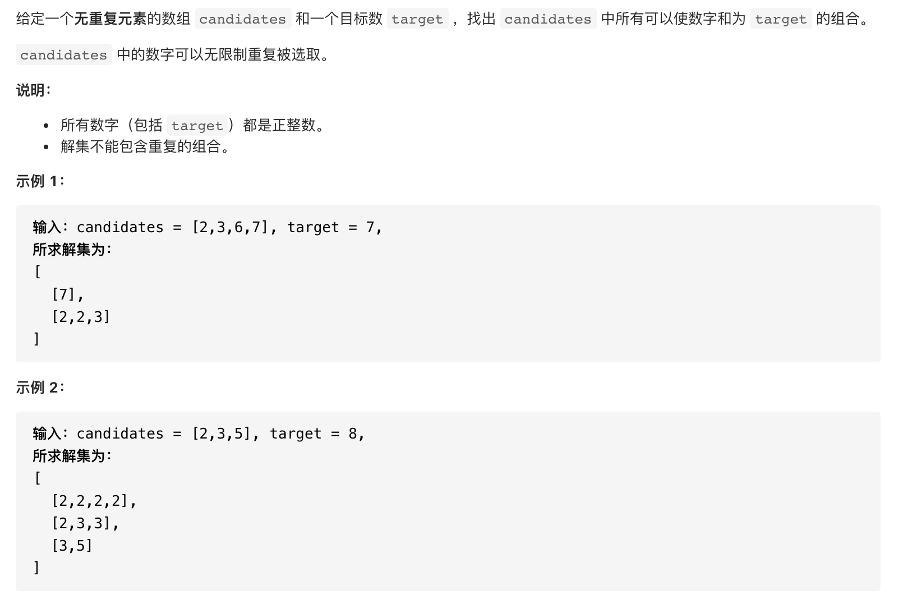
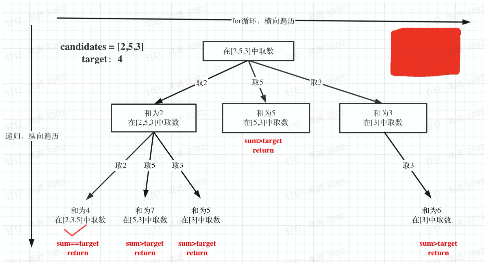

#  **题目描述（中等难度）**

> **[warning] [39. 组合总和](https://leetcode-cn.com/problems/combination-sum/)**



#解法一：回溯法

抽象为树型结构如下


```java
class Solution {
    List<List<Integer>> resp = new ArrayList<>();
    List<Integer> ans = new ArrayList<>();
    public List<List<Integer>> combinationSum(int[] candidates, int target) {
        backTracking(candidates,target,0);
        return resp;

    }

    public void backTracking(int[] candidates,int target,int sum){
        if(sum > target){
            return;
        }
        if(sum == target){
         List<Integer> list = new ArrayList<>(ans);
         Collections.sort(list);
         if(!resp.contains(list)){
         resp.add(list);   
         }
         return;
        }
        for(int i=0;i<candidates.length;i++){
          sum = sum + candidates[i];
          ans.add(candidates[i]);
          backTracking(candidates,target,sum);
          ans.remove(ans.size()-1);
          sum = sum - candidates[i];
        }
    }
}
```

优化上面代码，加入startIndex,什么时候需要加startIndex? 对单个集合求组合的时候加入startIndex
```java
class Solution {
    List<List<Integer>> resp = new ArrayList<>();
    List<Integer> ans = new ArrayList<>();
    public List<List<Integer>> combinationSum(int[] candidates, int target) {
        backTracking(candidates,target,0,0);
        return resp;

    }

    public void backTracking(int[] candidates,int target,int sum,int startIndex){
        if(sum > target){
            return;
        }
        if(sum == target){
         resp.add(new ArrayList<>(ans));   
         return;
        }
        for(int i=startIndex;i<candidates.length;i++){
          sum = sum + candidates[i];
          ans.add(candidates[i]);
          backTracking(candidates,target,sum,i);//不用i+1,表示可以重复读取当前的数，不能重复读取需要i+1
          ans.remove(ans.size()-1);
          sum = sum - candidates[i];
        }
    }
}
```

剪支优化

对总集合排序之后，如果下⼀层的sum（就是本层的 sum + candidates[i]）已经⼤于target，就可以
结束本轮for循环的遍历。

```java
class Solution {
    List<List<Integer>> resp = new ArrayList<>();
    List<Integer> ans = new ArrayList<>();
    public List<List<Integer>> combinationSum(int[] candidates, int target) {
        Arrays.sort(candidates);
        backTracking(candidates,target,0,0);
        return resp;

    }

    public void backTracking(int[] candidates,int target,int sum,int startIndex){
        if(sum > target){
            return;
        }
        if(sum == target){
         resp.add(new ArrayList<>(ans));   
         return;
        }
        for(int i=startIndex;i<candidates.length && sum+candidates[i] <= target ;i++){
          sum = sum + candidates[i];
          ans.add(candidates[i]);
          backTracking(candidates,target,sum,i);
          ans.remove(ans.size()-1);
          sum = sum - candidates[i];
        }
    }
}
```


