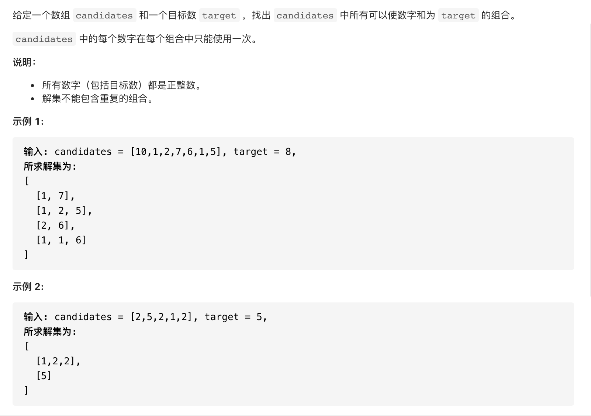

#  **题目描述（中等难度）**

> **[warning] [40. 组合总和 II](https://leetcode-cn.com/problems/combination-sum-ii/)**



#解法一：回溯去重

```java
class Solution {
    List<List<Integer>> resp = new ArrayList<>();
    List<Integer> ans = new ArrayList<>();
    public List<List<Integer>> combinationSum2(int[] candidates, int target) {
        backTracking(candidates,target,0,0);
        return resp;
    }

    public void backTracking(int[] candidates,int target,int sum,int startIndex){
      if(sum > target){
          return;
      }
      if(sum == target){
          List<Integer> temp = new ArrayList<>(ans);
          Collections.sort(temp);
          if(!resp.contains(temp)){
           resp.add(temp);
          }
          return;
      }
      for(int i=startIndex;i<candidates.length;i++){
          sum = sum + candidates[i];
          ans.add(candidates[i]);
          backTracking(candidates,target,sum,i+1);
          ans.remove(ans.size()-1);
          sum = sum - candidates[i]; 
      }
    }
}
```

优化上面代码，排序去重

```java
class Solution {
    List<List<Integer>> resp = new ArrayList<>();
    List<Integer> ans = new ArrayList<>();
    public List<List<Integer>> combinationSum2(int[] candidates, int target) {
        Arrays.sort(candidates);
        backTracking(candidates,target,0,0);
        return resp;
    }

    public void backTracking(int[] candidates,int target,int sum,int startIndex){
      if(sum > target){
          return;
      }
      if(sum == target){
           resp.add(new ArrayList<>(ans));
          return;
      }
      for(int i=startIndex;i<candidates.length && sum+candidates[i] <=target;i++){
          if(i > startIndex && candidates[i] == candidates[i-1]) continue;
          sum = sum + candidates[i];
          ans.add(candidates[i]);
          backTracking(candidates,target,sum,i+1);
          ans.remove(ans.size()-1);
          sum = sum - candidates[i]; 
      }
    }
}
```

