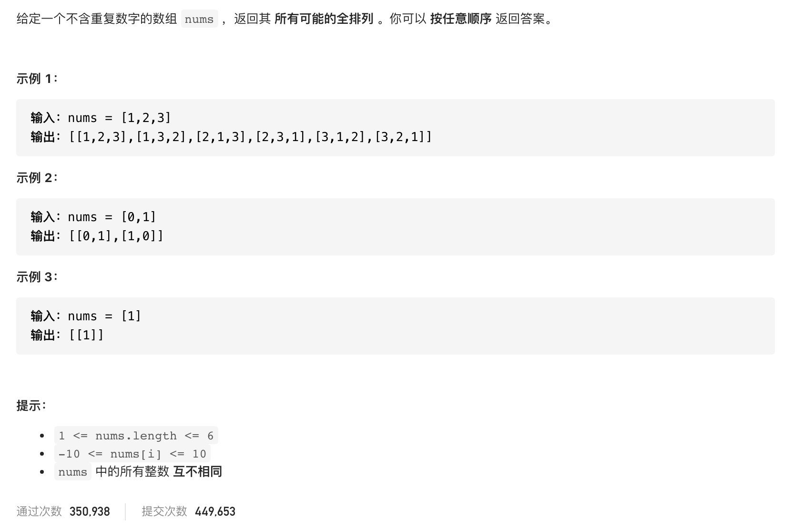

#  **题目描述（中等难度）**

> **[warning] [46. 全排列](https://leetcode-cn.com/problems/permutations/)**



#解法一：回溯
```java
class Solution {
    List<List<Integer>> resp = new ArrayList<>();
    List<Integer> ans = new ArrayList<>();
    public List<List<Integer>> permute(int[] nums) {
     if(null == nums || nums.length == 0){
         return resp;
     }
     backTracking(nums);
     return resp;
    }
    public void backTracking(int[] nums){
        //终止条件
        if(ans.size() == nums.length){
            resp.add(new ArrayList<>(ans));
            return;
        }
        //处理数据
        for(int i=0;i<nums.length;i++){
            if(ans.contains(nums[i])){
                continue;
            }
            ans.add(nums[i]);
            //递归
            backTracking(nums);
            //回溯
            ans.remove(ans.size()-1);
        }

    }
}
```

优化上面代码，使用一个used 数组来保存访问过的元素，回溯记得标记为false

```java
class Solution {
    List<List<Integer>> resp = new ArrayList<>();
    List<Integer> ans = new ArrayList<>();
    boolean[] used;
    public List<List<Integer>> permute(int[] nums) {
     if(null == nums || nums.length == 0){
         return resp;
     }
     used = new boolean[nums.length];
     backTracking(nums);
     return resp;
    }
    public void backTracking(int[] nums){

        if(ans.size() == nums.length){
            resp.add(new ArrayList<>(ans));
            return;
        }
        for(int i=0;i<nums.length;i++){
            if(used[i] == true){
                continue;
            }
            used[i] = true;
            ans.add(nums[i]);
            //递归
            backTracking(nums);
            //回溯
            ans.remove(ans.size()-1);
            used[i] = false;
        }
    }
}
```

