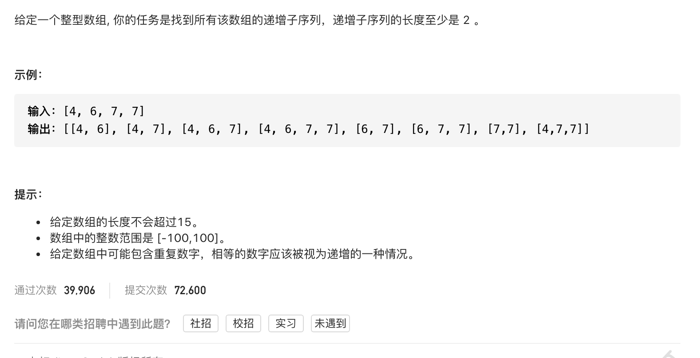

#  **题目描述（中等难度）**

> **[warning] [491. 递增子序列](https://leetcode-cn.com/problems/increasing-subsequences/)**



#解法一： 回溯


```java
class Solution {
    List<List<Integer>> resp = new ArrayList<>();
    List<Integer> ans = new ArrayList<>();
    public List<List<Integer>> findSubsequences(int[] nums) {
        if(null == nums || nums.length == 0){
            return resp;
        }
        backTracking(nums,0);
        return resp;
    }

    public void backTracking(int[] nums,int startIndex){
        List<Integer> temp = new ArrayList<>(ans);
        if(!resp.contains(temp) && temp.size() >1 && isValid(temp)){
           resp.add(temp);
        }
    
        if(startIndex >= nums.length){
            return;
        }
        for(int i=startIndex;i<nums.length;i++){
            ans.add(nums[i]);
            backTracking(nums,i+1);
            ans.remove(ans.size()-1);
        }
    }

    public boolean isValid(List<Integer> list){
        for(int i=1;i<list.size();i++){
          if(list.get(i) < list.get(i-1)){
              return false;
          }
        }
        return true;
    }
}
```


