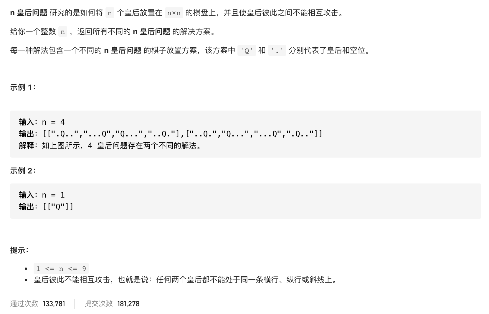

#  **题目描述（中等难度）**

> **[warning] [51. N 皇后](https://leetcode-cn.com/problems/n-queens/)**



#解法一：回溯

```java
class Solution {
    List<List<String>> resp = new ArrayList<>();
    public List<List<String>> solveNQueens(int n) {
     char[][] chessboard = new char[n][n];
     for(char[] c : chessboard){
         Arrays.fill(c,'.');
     }
     backTracking(n,chessboard,0);
     return resp;
    }

    public void backTracking(int n,char[][] chessboard,int row){
      if(row == n){
          List<String> temp = new ArrayList<>();
          for(char[] c: chessboard){
              temp.add(String.valueOf(c));
          }
          resp.add(temp);
          return;
      }
      for(int col=0;col<n;col++){
          if(isValid(col,row,n,chessboard)){
              chessboard[row][col] = 'Q';
              backTracking(n,chessboard,row+1);
               chessboard[row][col] = '.';
          }
      }
    }

    public boolean isValid(int col,int row,int n,char[][] chessboard){
        //校验列
        for(int i=0;i<row;i++){
            if(chessboard[i][col] == 'Q'){
                return false;
            }
        }
        //45度对角线校验
        for(int i=row-1,j=col-1;i>=0&&j>=0;i--,j--){
            if(chessboard[i][j] == 'Q'){
                return false;
            }
        }

        for(int i=row-1,j=col+1;i>=0&&j<n;i--,j++){
            if(chessboard[i][j] == 'Q'){
                return false;
            }
        }
        return true;
    }
}
```


