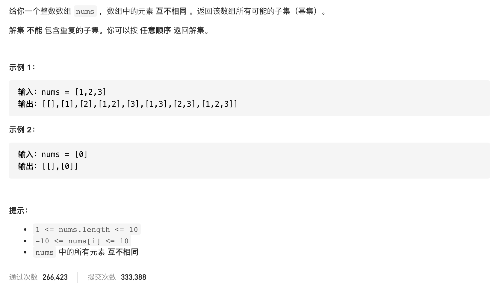

#  **题目描述（中等难度）**

> **[warning] [78. 子集](https://leetcode-cn.com/problems/subsets/)*



#解法一： 回溯

```java
class Solution {
    List<List<Integer>> resp = new ArrayList<>();
    List<Integer> ans = new ArrayList<>();
    public List<List<Integer>> subsets(int[] nums) {
         backTracking(nums,0);
         return resp;
    }

    public void backTracking(int[] nums,int startIndex){
        resp.add(new ArrayList<>(ans));
        if(startIndex >= nums.length){
           return;
        }
        for(int i=startIndex;i<nums.length;i++){
            ans.add(nums[i]);
            backTracking(nums,i+1);
            ans.remove(ans.size()-1);
        }
    }
}
```


