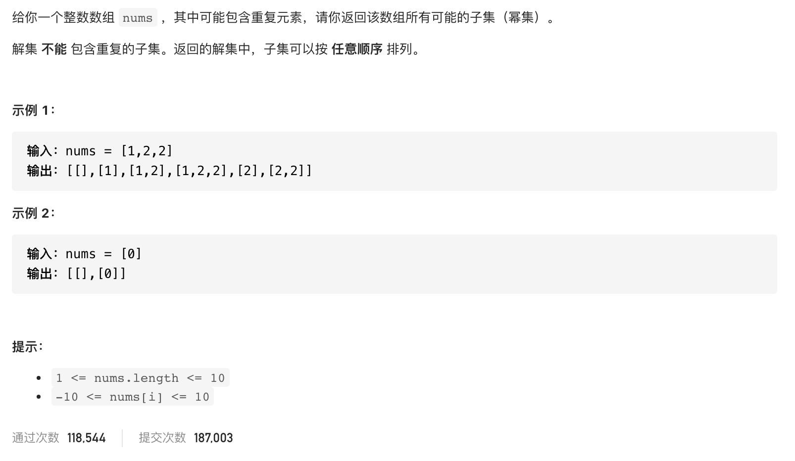

#  **题目描述（中等难度）**

> **[warning] [90. 子集 II](https://leetcode-cn.com/problems/subsets-ii/)*



#解法一：回溯
```java
class Solution {
    List<List<Integer>> resp = new ArrayList<>();
    List<Integer> ans = new ArrayList<>();
    public List<List<Integer>> subsetsWithDup(int[] nums) {
      Arrays.sort(nums); 
      if(null == nums || nums.length == 0){
          return resp;
      }
      boolean[] used = new boolean[nums.length];
      backTracking(nums,0,used);
      return resp;
    }

    public void backTracking(int[] nums,int startIndex,boolean[] used){
        resp.add(new ArrayList<>(ans));
        if(startIndex >= nums.length){
            return;
        }
        for(int i=startIndex;i<nums.length;i++){
            if(used[i] == true || (i>0 && nums[i] == nums[i-1] && used[i-1] == false)){
                continue;
            }
            used[i] = true;
            ans.add(nums[i]);
            backTracking(nums,i+1,used);
            ans.remove(ans.size()-1);
            used[i] = false;
        }

    }
}
```


