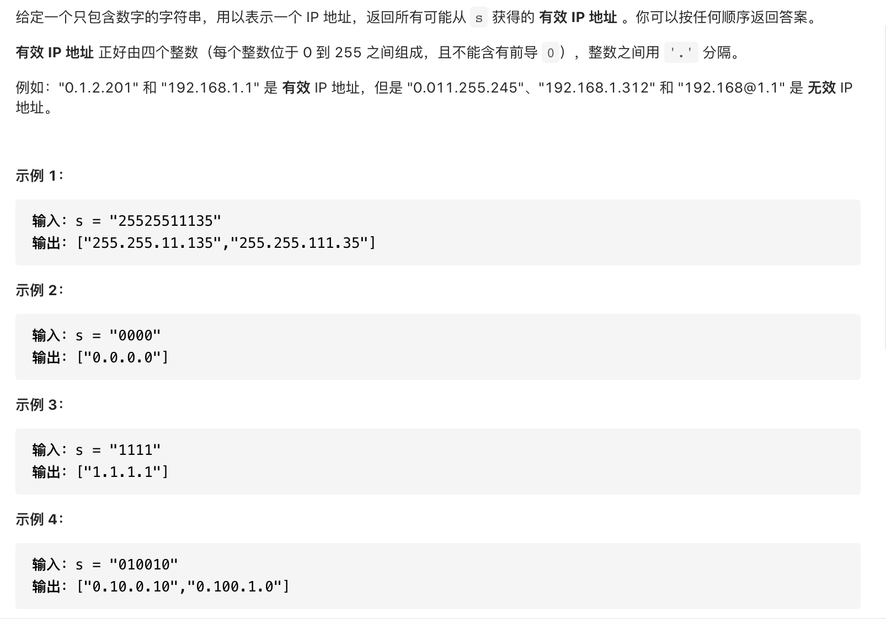

#  **题目描述（中等难度）**

> **[warning] [93. 复原 IP 地址](https://leetcode-cn.com/problems/restore-ip-addresses/)**



#解法一：回溯

```java
class Solution {
    List<String> resp = new ArrayList<>();
    public List<String> restoreIpAddresses(String s) {
      if(s.length() > 12 || s.length() < 4){
          return resp;
      }
      backTracking(s,0,0);
      return resp;
    }

    public void backTracking(String s,Integer startIndex,int pointNum){
      if(pointNum == 3){
          if(isValid(s,startIndex,s.length()-1)){
              resp.add(s);
          }
          return;
      }
      for(int i=startIndex;i<s.length();i++){
         if(isValid(s,startIndex,i)){
            s = s.substring(0,i+1)+ "."+ s.substring(i+1);
            pointNum++;
            backTracking(s,i+2,pointNum);
            pointNum--;
            s = s.substring(0,i+1) + s.substring(i+2);//删除逗号
         }
         else{
             break;
         }
      }
    }

    //校验分割的数据是否是有效的
        private Boolean isValid(String s, int start, int end) {
        if (start > end) {
            return false;
        }
        if (s.charAt(start) == '0' && start != end) { // 0开头的数字不合法
            return false;
        }
        int num = 0;
        for (int i = start; i <= end; i++) {
            if (s.charAt(i) > '9' || s.charAt(i) < '0') { // 遇到⾮数字字符不合法
                return false;
            }
            num = num * 10 + (s.charAt(i) - '0');
            if (num > 255) { // 如果⼤于255了不合法
                return false;
            }
        }
        return true;
    }
}
```
