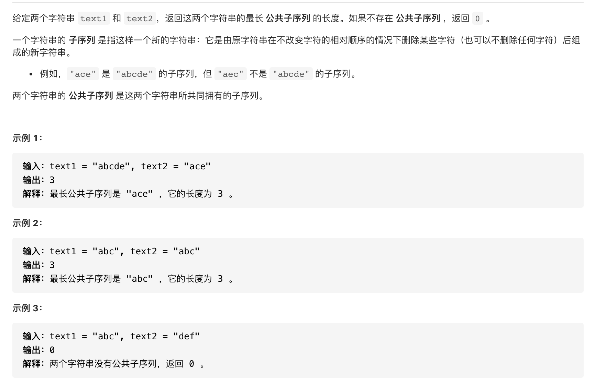

#  **题目描述（中等难度）**

> **[warning] [1143. 最长公共子序列](https://leetcode-cn.com/problems/longest-common-subsequence/)**



#解法一：暴力法，求出字符串所有子序列，再取出最大的，超时

```java
class Solution {
    Set<String> aMap = new HashSet<>();
    Set<String> bMap = new HashSet<>();
    public int longestCommonSubsequence(String text1, String text2) {
        if(text1 != null || text1.length() != 0){
           subStr(text1.toCharArray(),0,"",aMap);
        }
        if(text2 != null || text2.length() != 0){
           subStr(text2.toCharArray(),0,"",bMap); 
        }
        int max = 0;
        for(String s : aMap){
            if(bMap.contains(s)){
                max = Math.max(max,s.length());
            }
        }
        return max;
    }

    //递归求所有子序列
    public void subStr(char[] str,int index,String res,Set<String> set){
        if(index == str.length){
            set.add(res);
            return;
        }
        subStr(str,index+1,res,set);
        subStr(str,index+1,res+String.valueOf(str[index]),set);
    }
    
}
```

#解法二：动态规划

```java
class Solution {
    public int longestCommonSubsequence(String text1, String text2) {
      int m = text1.length();
      int n = text2.length();
      int[][] dp = new int[m+1][n+1];
      for(int i=1;i<=m;i++){
        for(int j=1;j<=n;j++){
            if(text1.charAt(i-1) == text2.charAt(j-1)){
                dp[i][j] = dp[i-1][j-1]+1;
            }
            else{
                dp[i][j] = Math.max(dp[i-1][j],dp[i][j-1]);
            }  
        }
      }
      return dp[m][n];
    }
}
```

