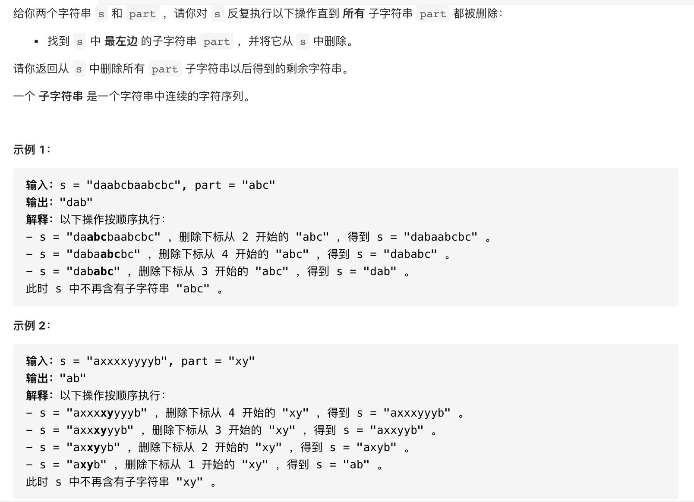

#  **题目描述（中等难度）**

> **[warning] [1910. 删除一个字符串中所有出现的给定子字符串](https://leetcode-cn.com/problems/remove-all-occurrences-of-a-substring/)**



#解法一： 递归

使用indexOf 获取给定字符串开始的索引， 通过substring 截断part字符串

```java
class Solution {
    public String removeOccurrences(String s, String part) {
         if(!s.contains(part)){
             return s;
         }
          int i = s.indexOf(part);
          s = s.substring(0, i) + s.substring(i + part.length());
         return removeOccurrences(s,part);
    }
}
```

也可以使用replaceFirst 将part部分替换为"" 效率不如方法一

```java
class Solution {
    public String removeOccurrences(String s, String part) {
        if(!s.contains(part)){
            return s;
        }
        s = s.replaceFirst(part,"");
        return removeOccurrences(s,part);
    }
}
```

