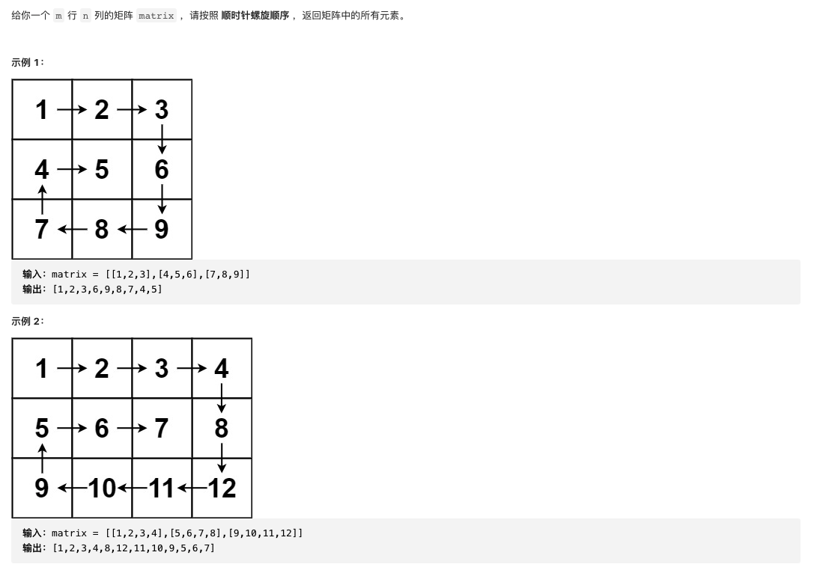

#  **题目描述（中等难度）**

> **[warning] [54. 螺旋矩阵](https://leetcode-cn.com/problems/spiral-matrix/)**



#解法一：按层模拟

可以将矩阵看成若干层，首先输出最外层的元素，其次输出次外层的元素，直到输出最内层的元素。

定义矩阵的第 kk 层是到最近边界距离为 k 的所有顶点。例如，下图矩阵最外层元素都是第 1 层，次外层元素都是第 2 层，剩下的元素都是第 3 层。

```java
class Solution {
    public List<Integer> spiralOrder(int[][] matrix) {
       List<Integer> resp = new ArrayList<>();
       if(matrix.length == 0 || null == matrix){
           return resp;
       }
       int left = 0;
       int right = matrix[0].length-1;
       int top = 0;
       int bottom = matrix.length-1;
       int numEle = matrix[0].length * matrix.length;
       while(numEle >=1){
        for(int i = left ;i<=right && numEle>=1;i++){
            resp.add(matrix[top][i]);
            numEle--;
        }
        top++;
        for(int i =top;i<=bottom && numEle>=1;i++){
            resp.add(matrix[i][right]);
            numEle--;
        }
        right--;
        for(int i= right;i>=left && numEle>=1;i--){
            resp.add(matrix[bottom][i]);
             numEle--;
        }
        bottom--;
        for(int i = bottom;i>=top&& numEle>=1;i--){
            resp.add(matrix[i][left]);
            numEle--;
        }
        left++;
       }
       return resp;
    }
}
```


