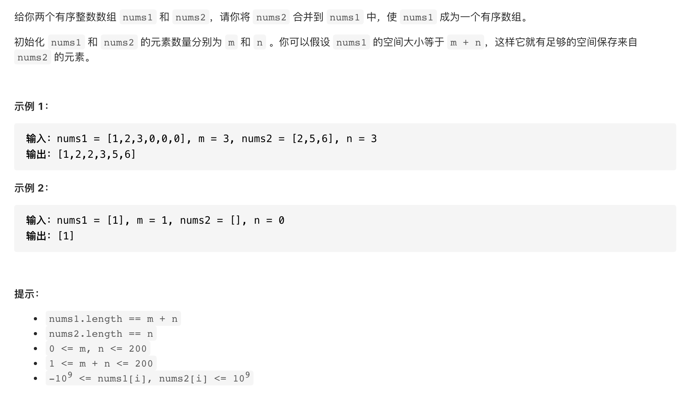

#  **题目描述（中等难度）**

> **[88. 合并两个有序数组](https://leetcode-cn.com/problems/merge-sorted-array/)**



#解法一：合并后排序

```java
class Solution {
    public void merge(int[] nums1, int m, int[] nums2, int n) {
       int index = 0; 
       for(int i=m;i<m+n;i++){
           if(index < n){
           nums1[i] = nums2[index];
           index++;
           }
       }
       Arrays.sort(nums1);
    }   
   
}
```

#解法二：双指针
```java
class Solution {
    public void merge(int[] nums1, int m, int[] nums2, int n) {
      
      int i = 0;
      int j = 0;
      int index = 0;
      int[] temp = new int[m+n];
      while(i< m && j<n){
        if(nums1[i] < nums2[j]){
           temp[index] = nums1[i];
           i++;
           index++;
        }  
        else{
            temp[index] = nums2[j];
            j++;
            index++;
        }
      }
      while(i<m){
          temp[index] = nums1[i];
          i++;
          index++;
      }
      while(j<n){
          temp[index] = nums2[j];
          j++;
          index++;
      }

      for(int k=0;k<temp.length;k++){
          nums1[k] = temp[k];
      }
    
    }   
   
}
```

#解法三： 原地排序双指针
```java
class Solution {
    public void merge(int[] nums1, int m, int[] nums2, int n) {
      
      int i= m-1;
      int j = n-1;
      int index = m+n-1;
      while(i>=0 && j>=0){
          if(nums1[i] > nums2[j]){
             nums1[index] = nums1[i];
             i--;
             index--;
          }
          else{
              nums1[index] = nums2[j];
              j--;
              index--;
          }
      }
      while(i>=0){
          nums1[index] = nums1[i];
          i--;
          index--;
      }
      while(j>=0){
          nums1[index] = nums2[j];
          j--;
          index--;
      }


    
    }   
   
}
```

