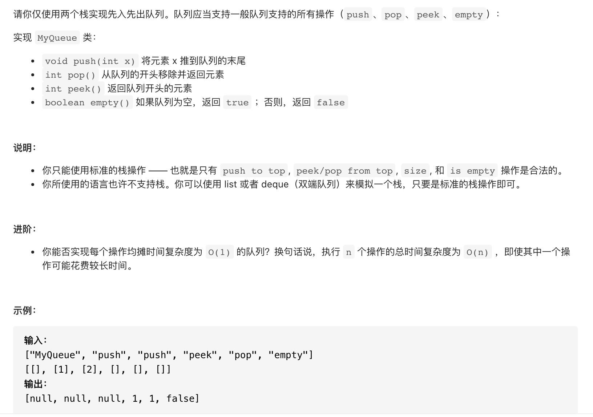

#  **题目描述（简单难度）**

> **[success] [232. 用栈实现队列](https://leetcode-cn.com/problems/implement-queue-using-stacks/)**



#解法一：用双栈实现队列
思路

将一个栈当作输入栈，用于压入push 传入的数据；另一个栈当作输出栈，用于 pop 和 peek 操作。

每次 pop 或 peek 时，若输出栈为空则将输入栈的全部数据依次弹出并压入输出栈，这样输出栈从栈顶往栈底的顺序就是队列从队首往队尾的顺序。

```java
class MyQueue {

    Deque<Integer> inDeque;
    Deque<Integer> outDeque;

    /** Initialize your data structure here. */
    public MyQueue() {
        inDeque = new LinkedList<>();
        outDeque = new LinkedList<>();
    }
    
    /** Push element x to the back of queue. */
    public void push(int x) {
      inDeque.offer(x);
    }
    
    /** Removes the element from in front of queue and returns that element. */
    public int pop() {
      if(outDeque.isEmpty()){
          while(!inDeque.isEmpty()){
              outDeque.offer(inDeque.poll());
          }
      }
        return outDeque.poll();
    }
    
    /** Get the front element. */
    public int peek() {
        if(outDeque.isEmpty()){
            while(!inDeque.isEmpty()){
              outDeque.offer(inDeque.poll());
          }
          }
         return outDeque.peek();
    }
    
    /** Returns whether the queue is empty. */
    public boolean empty() {
       return inDeque.isEmpty() && outDeque.isEmpty();
    }
}

/**
 * Your MyQueue object will be instantiated and called as such:
 * MyQueue obj = new MyQueue();
 * obj.push(x);
 * int param_2 = obj.pop();
 * int param_3 = obj.peek();
 * boolean param_4 = obj.empty();
 */
```


