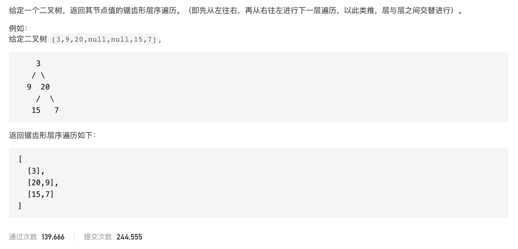

#  **题目描述（中等难度）**

> **[warning] [103. 二叉树的锯齿形层序遍历](https://leetcode-cn.com/problems/binary-tree-zigzag-level-order-traversal/)**



# 解法一：BFS 
使用层序遍历输出，再判断，如果是奇数层的数就不变，偶数层的数倒序输出
```java
class Solution {
    public List<List<Integer>> zigzagLevelOrder(TreeNode root) {
        if(null == root){
            return new ArrayList<>();
        }
        Deque<TreeNode> deque = new LinkedList<>();
        deque.offer(root);
        int level = 0;
        List<List<Integer>> resp = new ArrayList<>();
        while(!deque.isEmpty()){
            level++;
            int size = deque.size();
            List<Integer> list = new ArrayList<>();
            for (int i = 0; i < size; i++) {
                TreeNode poll = deque.poll();
                list.add(poll.val);
                if (null != poll.left) {
                    deque.offer(poll.left);
                }
                if (null != poll.right) {
                    deque.offer(poll.right);
                }
            }
            resp.add(list);
        }
        List<List<Integer>> lists = new ArrayList<>();
        for(int i=0;i<resp.size();i++){
            if(i % 2 != 0){
                lists.add(reverse(resp.get(i))) ;
            }
            else{
                lists.add(resp.get(i));
            }
        }
        return lists;
    }

    public List<Integer> reverse(List<Integer> list){
       List<Integer> resp = new ArrayList<>();
       for(int i=list.size()-1;i>=0;i--){
           resp.add(list.get(i));
       }
       return resp;
    }
}
```

BFS优化，使用双端队列，偶数的时候就数据加在头部，奇数的时候加在尾部
```java
class Solution {
    public List<List<Integer>> zigzagLevelOrder(TreeNode root) {
        if (null == root) {
            return new ArrayList<>();
        }
        Deque<TreeNode> deque = new LinkedList<>();
        deque.offer(root);
        int level = 0;
        List<List<Integer>> resp = new ArrayList<>();
        while (!deque.isEmpty()) {
            level++;
            int size = deque.size();
            Deque<Integer> list = new LinkedList<>();
            for (int i = 0; i < size; i++) {
                TreeNode poll = deque.poll();
                if (level % 2 != 0) {
                    list.offerLast(poll.val);
                } else {
                    list.offerFirst(poll.val);
                }
                if (null != poll.left) {
                    deque.offer(poll.left);
                }
                if (null != poll.right) {
                    deque.offer(poll.right);
                }
            }
            resp.add(new LinkedList<Integer>(list));
        }
        return resp;
    }
}
```

