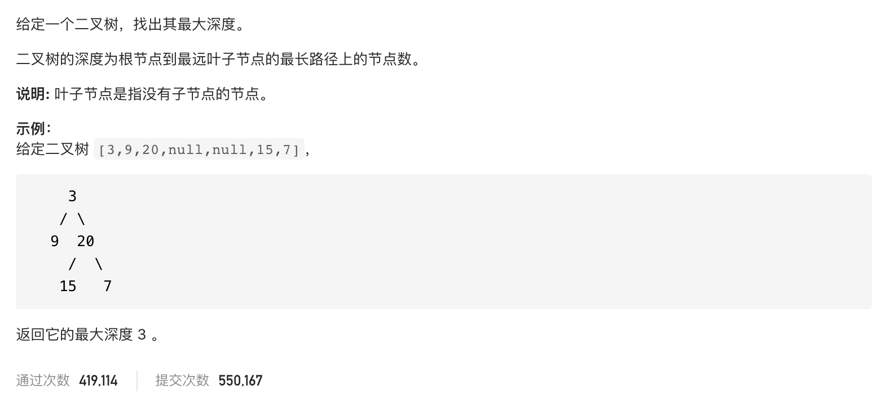

#  **题目描述（中等难度）**

> **[warning] [104. 二叉树的最大深度](https://leetcode-cn.com/problems/maximum-depth-of-binary-tree/)**



#解法一：DFS

比较左子树与右子树的最大深度 ，求二叉树深度的模板
```java
class Solution {
   
    public int maxDepth(TreeNode root) {
      if(root == null){
          return 0;
      }
      return preOrder(root);
    }

    public int preOrder(TreeNode root){
        if(root == null){
            return 0;
        }
        return Math.max(preOrder(root.left),preOrder(root.right))+1;
    }
}
```

#解法二：BFS
求二叉树的层次深度即可
```java
class Solution {
    public int maxDepth(TreeNode root) {
        if (root == null) {
            return 0;
        }
        int depth = 0;
        Deque<TreeNode> deque = new LinkedList<>();
        deque.offer(root);
        while (!deque.isEmpty()) {
            int size = deque.size();
            depth++;
            for (int i = 0; i < size; i++) {
                TreeNode poll = deque.poll();
                if (null != poll.left) {
                    deque.offer(poll.left);
                }
                if (null != poll.right) {
                    deque.offer(poll.right);
                }
            }
        }
        return depth;
    }
}
```


