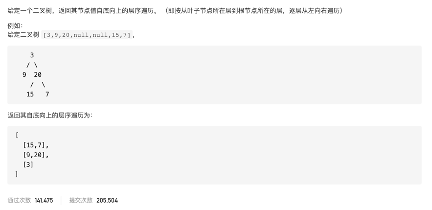

#  **题目描述（中等难度）**

> **[warning] [107. 二叉树的层序遍历 II](https://leetcode-cn.com/problems/binary-tree-level-order-traversal-ii/)**



#解法一：BFS 
使用双端队列，每次层次遍历添加再队列头部，最后再从头部出队列
```java
class Solution {
    public List<List<Integer>> levelOrderBottom(TreeNode root) {
     if(null == root){
         return new ArrayList<>();
     }
     Deque<TreeNode> deque = new LinkedList<>();
     deque.offer(root);
     Deque<List<Integer>> ans = new LinkedList<>();
     while(!deque.isEmpty()){
         int size = deque.size();
         List<Integer> list = new ArrayList<>();
         for(int i=0;i<size;i++){
             TreeNode poll = deque.poll();
             list.add(poll.val);
             if(null != poll.left){
                 deque.offer(poll.left);
             }
             if(null != poll.right){
                 deque.offer(poll.right);
             }
         }
         ans.offerFirst(list);
     }
     List<List<Integer>> resp = new ArrayList<>();
     while(!ans.isEmpty()){
         resp.add(ans.poll());
     }
     return resp;
    }
}
```

优化上面代码，使用LinkedList ,每次在头部添加元素
```java
class Solution {
    public List<List<Integer>> levelOrderBottom(TreeNode root) {
     if(null == root){
         return new ArrayList<>();
     }
     Deque<TreeNode> deque = new LinkedList<>();
     deque.offer(root);
     LinkedList<List<Integer>> ans = new LinkedList<>();
     while(!deque.isEmpty()){
         int size = deque.size();
         List<Integer> list = new ArrayList<>();
         for(int i=0;i<size;i++){
             TreeNode poll = deque.poll();
             list.add(poll.val);
             if(null != poll.left){
                 deque.offer(poll.left);
             }
             if(null != poll.right){
                 deque.offer(poll.right);
             }
         }
         ans.addFirst(list);
     }
     return ans;
    }
}
```

#解法二：DFS
通过深度优先搜索进行处理，首先进入的是上层，其次才是下层，并构造当前层存储容器。

为了满足自底向上的层序遍历，在每进入新一层构建当前层存储容器时，需要将存储容器插入到结果集的头部。

```java
class Solution {
    List<List<Integer>> res = new ArrayList<>();
    public List<List<Integer>> levelOrderBottom(TreeNode root) {
        levelOrderBottom(root, 0);
        return res;
    }

    public void levelOrderBottom(TreeNode root, int level) {
        if (root == null) return;
        if (res.size() <= level) res.add(0, new ArrayList<>());
        res.get(res.size() - level - 1).add(root.val);
        levelOrderBottom(root.left, level + 1);
        levelOrderBottom(root.right, level + 1);
    }
}
```
