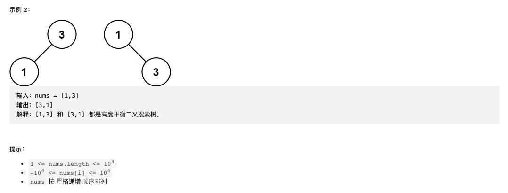

#  **题目描述（简单难度）**

> **[success] [108. 将有序数组转换为二叉搜索树](https://leetcode-cn.com/problems/convert-sorted-array-to-binary-search-tree/)**




#解法一：中序遍历，总是选择中间位置左边的数字作为根节点
```java
class Solution {
    public TreeNode sortedArrayToBST(int[] nums) {
       if(null == nums || nums.length == 0){
           return null;
       }
       return helper(nums,0,nums.length-1);
    }

    public TreeNode helper(int[] nums,int left,int right){
        if(left>right){
            return null;
        }
        int middle = (left+right)/2;
        TreeNode node = new TreeNode(nums[middle]);
        node.left = helper(nums,left,middle-1);
        node.right = helper(nums,middle+1,right);
        return node;
    }
}
```

#解法二：中序遍历，总是选择中间位置右边的数字作为根节点
```java
class Solution {
    public TreeNode sortedArrayToBST(int[] nums) {
       if(null == nums || nums.length == 0){
           return null;
       }
       return helper(nums,0,nums.length-1);
    }

    public TreeNode helper(int[] nums,int left,int right){
        if(left>right){
            return null;
        }
        int middle = (left+right+1)/2;
        TreeNode node = new TreeNode(nums[middle]);
        node.left = helper(nums,left,middle-1);
        node.right = helper(nums,middle+1,right);
        return node;
    }
}
```

#解法三：中序遍历，选择任意一个中间位置数字作为根节点
```java
class Solution {
    Random rand = new Random();

    public TreeNode sortedArrayToBST(int[] nums) {
        return helper(nums, 0, nums.length - 1);
    }

    public TreeNode helper(int[] nums, int left, int right) {
        if (left > right) {
            return null;
        }

        // 选择任意一个中间位置数字作为根节点
        int mid = (left + right + rand.nextInt(2)) / 2;

        TreeNode root = new TreeNode(nums[mid]);
        root.left = helper(nums, left, mid - 1);
        root.right = helper(nums, mid + 1, right);
        return root;
    }
}
```


