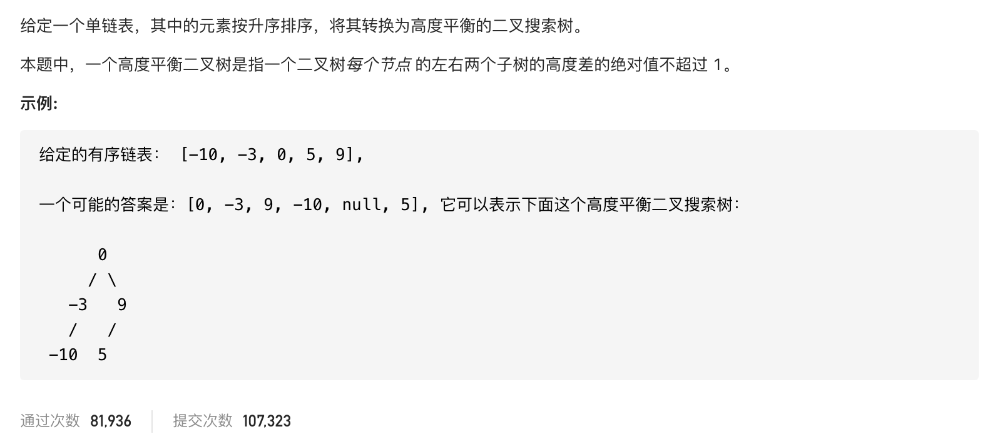

#  **题目描述（中等难度）**

> **[warning] [109. 有序链表转换二叉搜索树](https://leetcode-cn.com/problems/convert-sorted-list-to-binary-search-tree/)**



#解法一： 将链表转换为数组再转换为二叉搜索树

```java
class Solution {
    List<Integer> list = new ArrayList<>();
    public TreeNode sortedListToBST(ListNode head) {
       while(head != null){
           list.add(head.val);
           head = head.next;
       }
      return helper(list,0,list.size()-1);
    }
    
    public TreeNode helper(List<Integer> list,int left,int right){
        if(left > right){
            return null;
        }
        int middle = (left+right)/2;
        TreeNode node = new TreeNode(list.get(middle));
        node.left = helper(list,left,middle-1);
        node.right = helper(list,middle+1,right);
        return node;
    }
}
```
#解法二：


