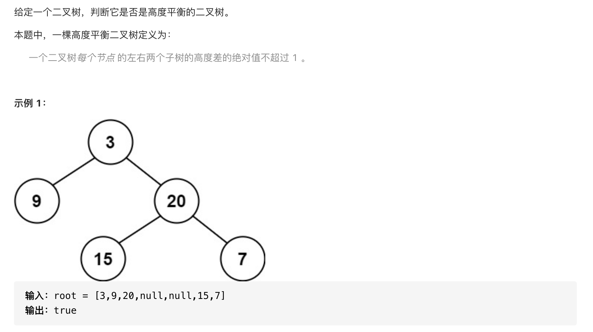
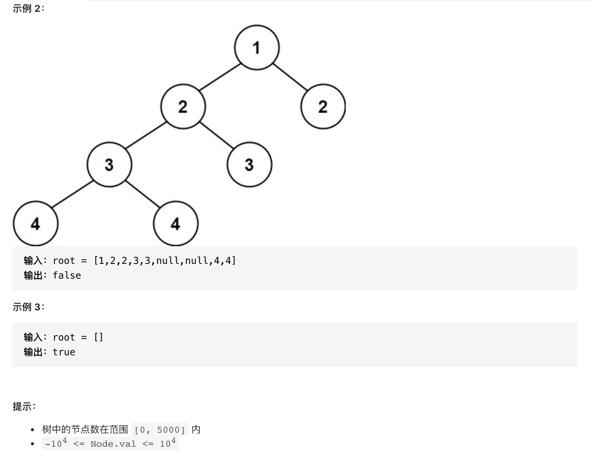

#  **题目描述（简单难度）**

> **[success] [110. 平衡二叉树](https://leetcode-cn.com/problems/balanced-binary-tree/)**





#解法一：DFS
遍历过程中判断左右子树的高度差

```java
class Solution {
    boolean flag = true;
    public boolean isBalanced(TreeNode root) {
      if(root == null){
          return true;
      }
      dfs(root);
      return flag;
    }
    
    public void dfs(TreeNode root){
        if(root == null){
            return;
        }
        if(Math.abs(level(root.left)-level(root.right)) >1){
            flag = false;
            return;
        }
        dfs(root.left);
        dfs(root.right);
    }

    public int level(TreeNode root) {
        if (root == null) {
            return 0;
        }
        int left = level(root.left);
        int right = level(root.right);
        return Math.max(left, right) + 1;
    }
}
```


