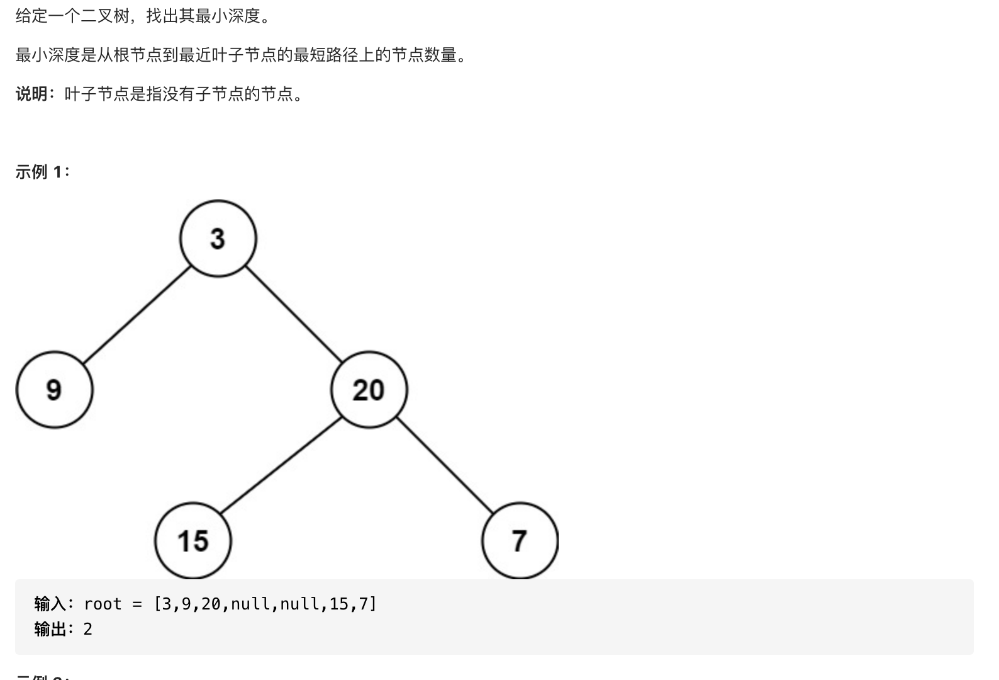

#  **题目描述（中等难度）**

> **[success] [111. 二叉树的最小深度](https://leetcode-cn.com/problems/minimum-depth-of-binary-tree/)**



#解法一： DFS
求最小深度时将Math.max换成Math.min即可，但要注意如果根节点的左或右子树为空的话是构不成子树的。而最小深度是要求从根节点到子树的。当左或右子树为空时，不符合要求。


```java
class Solution {
    
    public int minDepth(TreeNode root) {
      if(root == null){
          return 0;
      }
      if(root.left == null && root.right != null){
          return minDepth(root.right)+1;
      }
      if(root.left != null && root.right == null){
          return minDepth(root.left)+1;
      }
      return Math.min(minDepth(root.left),minDepth(root.right)) +1;
    }

}
```

#解法二：DFS求所有路径，再对路径求最小

```java
class Solution {
    List<List<Integer>> ans = new ArrayList<>();
    public int minDepth(TreeNode root) {
       if(root == null){
           return 0;
       }
       Integer min = Integer.MAX_VALUE;
       dfs(root,new ArrayList<>());
       for(int i=0;i<ans.size();i++){
          List<Integer> list = ans.get(i);
          min = Math.min(min,list.size());
       }
       return min;
    }

    public void dfs(TreeNode root,List<Integer> list){
        if(root == null){
            return;
        }
        list.add(root.val);
        if(root.left == null && root.right == null){
            ans.add(list);
        }
        else{
           dfs(root.left,new ArrayList<>(list));
           dfs(root.right,new ArrayList<>(list)); 
        }
    }
}
```
