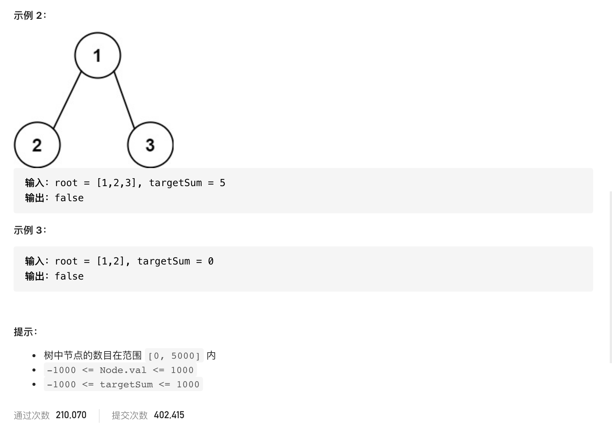

#  **题目描述（简单难度）**

> **[success] [112. 路径总和](https://leetcode-cn.com/problems/path-sum/)**




#解法一：DFS求所有路径、再对路径求和处理
```java
class Solution {
    List<List<Integer>> resp = new ArrayList<>();
    public boolean hasPathSum(TreeNode root, int targetSum) {
        if (root == null) {
            return false;
        }
        List<Integer> list = new ArrayList<>();
        dfs(root, list, targetSum);
        for (int i = 0; i < resp.size(); i++) {
            List<Integer> ans = resp.get(i);
            int sum = 0;
            ans.stream().map
            for (int j = 0; j < ans.size(); j++) {
                sum = sum + ans.get(j);
            }
            if (sum == targetSum) {
                return true;
            }
        }
        return false;
    }

    public void dfs(TreeNode root, List<Integer> list, int targetSum) {
        if (null == root) {
            return;
        }
        list.add(root.val);
        if (null == root.left && null == root.right) {
            resp.add(list);
        } else {
            dfs(root.left, new ArrayList<>(list), targetSum);
            dfs(root.right, new ArrayList<>(list), targetSum);
        }
    }
}
```

#解法二： DSF
每次递归用目前值减去跟节点值，走到叶子节点判断是否已经减到0了
```java
class Solution {
    public boolean hasPathSum(TreeNode root, int targetSum) {
       if(root == null){
           return false;
       }
       if(null == root.left && null == root.right){
           return targetSum - root.val == 0;
       }
       return hasPathSum(root.left,targetSum-root.val) || hasPathSum(root.right,targetSum-root.val);
    }
}
```

