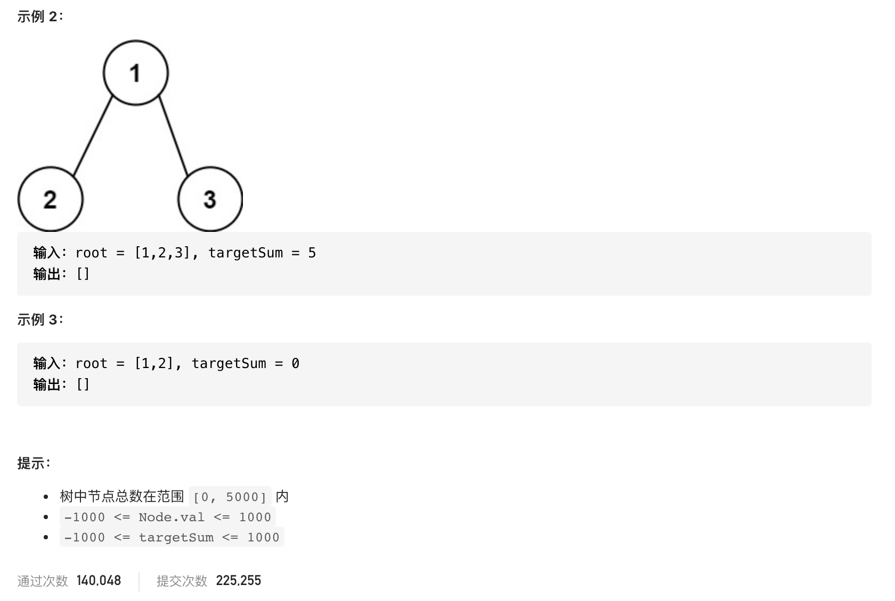

#  **题目描述（中等难度）**

> **[warning] [113. 路径总和 II](https://leetcode-cn.com/problems/path-sum-ii/)**




#解法一：暴力法
求出所有路径，再对路径做判断
```java
class Solution {
    List<List<Integer>> resp = new ArrayList<>();
    public List<List<Integer>> pathSum(TreeNode root, int targetSum) {
        if(null == root){
            return new ArrayList<>();
        }
        dfs(root,new ArrayList<>());
        List<List<Integer>>  ans = new ArrayList<>();
        for(int i=0;i<resp.size();i++){
            int sum = resp.get(i).stream().mapToInt(o->o).sum();
            if(sum == targetSum){
                ans.add(resp.get(i));
            }
        }
        return ans;
       
    }
    public void dfs(TreeNode root,List<Integer> list){
        if(null == root){
            return;
        }
        list.add(root.val);
        if(null == root.left && null == root.right){
            resp.add(list);
        }
        else{
            dfs(root.left,new ArrayList<>(list));
            dfs(root.right,new ArrayList<>(list));
        }
    }
}
```

#解法二：DFS优化

```java
class Solution {
    List<List<Integer>>  resp = new ArrayList<>();
    Deque<Integer> deque = new LinkedList<>();
    public List<List<Integer>> pathSum(TreeNode root, int targetSum) {
        if(null == root){
            return new ArrayList<>();
        }
        dfs(root,targetSum);
        return resp;
    }
    public void dfs(TreeNode root,int targetSum){
        if(null == root){
            return;
        }
        deque.offerLast(root.val);

        if(null == root.left && null == root.right){
            if(targetSum == root.val){
                resp.add(new LinkedList<>(deque));
            }
        }
        dfs(root.left,targetSum-root.val);
        dfs(root.right,targetSum-root.val);
        deque.pollLast();
    }
}
```


