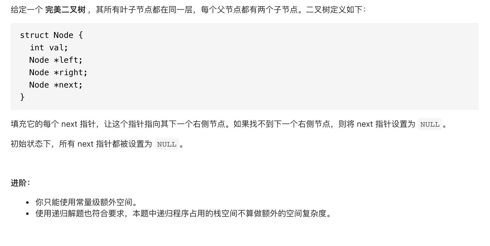
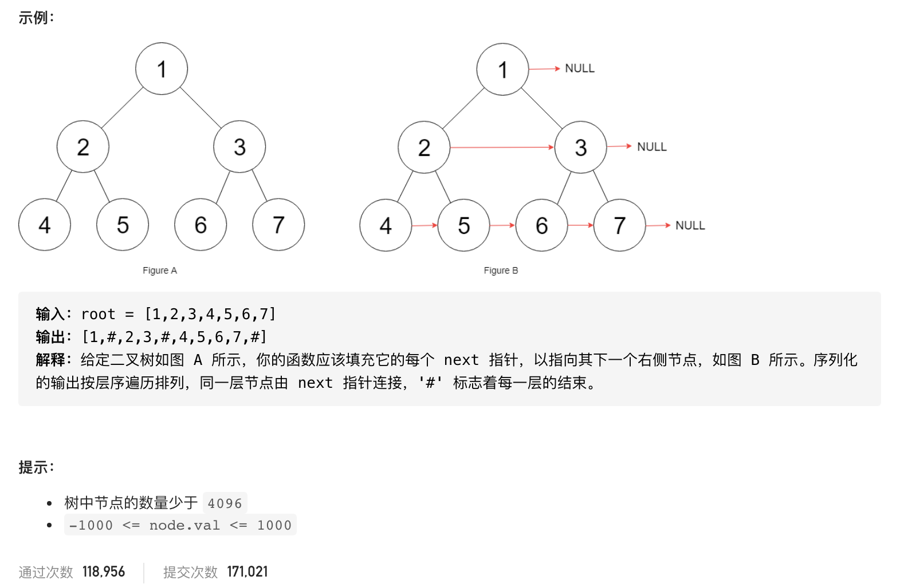

##  **题目描述（中等难度）**

> **[warning] [116. 填充每个节点的下一个右侧节点指针](https://leetcode-cn.com/problems/populating-next-right-pointers-in-each-node/)**




#解法一：BFS
层次遍历，连接成链表
```java
class Solution {
    public Node connect(Node root) {
        if(null == root){
            return root;
        }
        Deque<Node> deque = new LinkedList<>();
        deque.offer(root);
        while(!deque.isEmpty()){
            int size = deque.size();
            for(int i=0;i<size;i++){
               Node node =  deque.poll();
               if(i<size-1){
                   node.next = deque.peek();
               }
               if(node.left != null){
                   deque.offer(node.left);
               }
               if(node.right != null){
                   deque.offer(node.right);
               }
            }
        }
        return root;
    }
}
```

