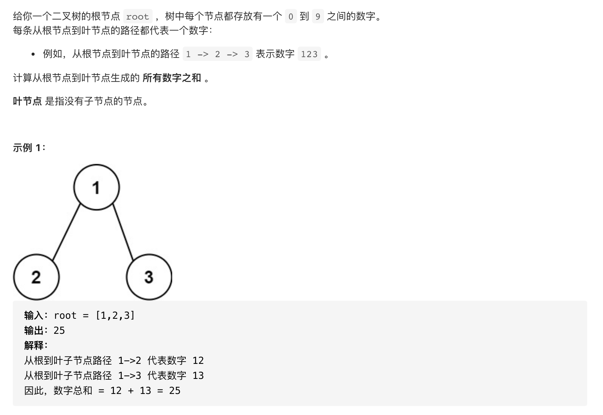
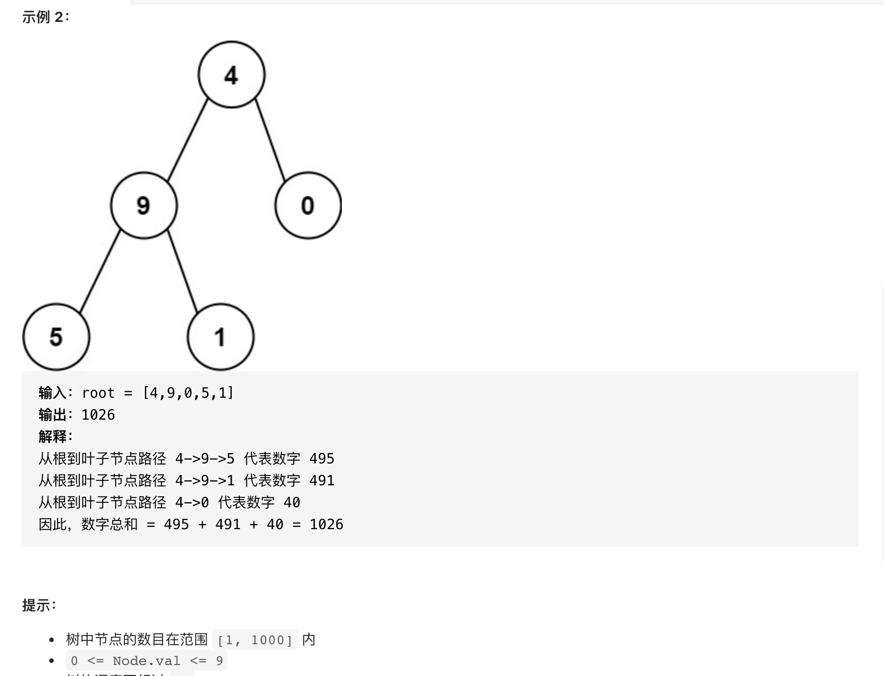

#  **题目描述（简单难度）**

> **[warning] [129. 求根节点到叶节点数字之和](https://leetcode-cn.com/problems/sum-root-to-leaf-numbers/)**




#解法一：DFS暴力破解

```java
class Solution {
    List<String> ans = new ArrayList<>();
    public int sumNumbers(TreeNode root) {
     if(root == null){
         return 0;
     }
     dfs(root,new StringBuilder());
     int sum = 0;
     for(int i=0;i<ans.size();i++){
      sum = sum+ Integer.valueOf(ans.get(i));
     }
     return sum;
    }
    public void dfs(TreeNode root,StringBuilder sb){
      if(null == root){
          return;
      }
      sb.append(root.val);
      if(null == root.left && null == root.right){
          ans.add(sb.toString());
      }
      else{
          dfs(root.left,new StringBuilder(sb));
          dfs(root.right,new StringBuilder(sb));
      }
    }
}
```


#解法二： 双百DFS
```java
class Solution {
    public int sumNumbers(TreeNode root) {
     if(null == root){
         return 0;
     }
     return dfs(root,0);
    }

    public int dfs(TreeNode root,int i){
        if(root == null){
            return 0;
        }
        int temp = i*10+root.val;
        if(root.left == null && root.right == null){
            return temp;
        }
       return dfs(root.left,temp) + dfs(root.right,temp);
    }
}
```
