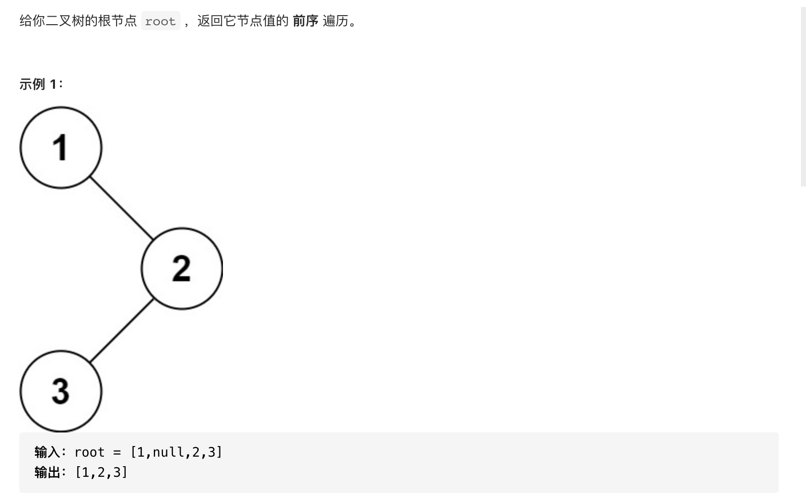

#  **题目描述（简单难度）**

> **[warning] [144. 二叉树的前序遍历](https://leetcode-cn.com/problems/binary-tree-preorder-traversal/)**



#解法一：DFS
```java
class Solution {
    List<Integer> resp = new ArrayList<>();
    public List<Integer> preorderTraversal(TreeNode root) {
      if(null == root){
          return new ArrayList<>();
      }
      dfs(root);
      return resp;
    }
    
    public void dfs(TreeNode root){
       if(root == null){
           return;
       }
       resp.add(root.val);
       dfs(root.left);
       dfs(root.right);
    }
}
```

#解法二： BFS

```java
class Solution {
    List<Integer> resp = new ArrayList<>();
    public List<Integer> preorderTraversal(TreeNode root) {
      if(null == root){
          return new ArrayList<>();
      }
      Deque<TreeNode> deque = new LinkedList<>();
      while(!deque.isEmpty() || root !=null){
          while(root != null){
              resp.add(root.val);
              deque.offerFirst(root);
              root = root.left;
          }
          root = deque.pollFirst();
          root = root.right;
      }
      return resp;
    }
}
```


