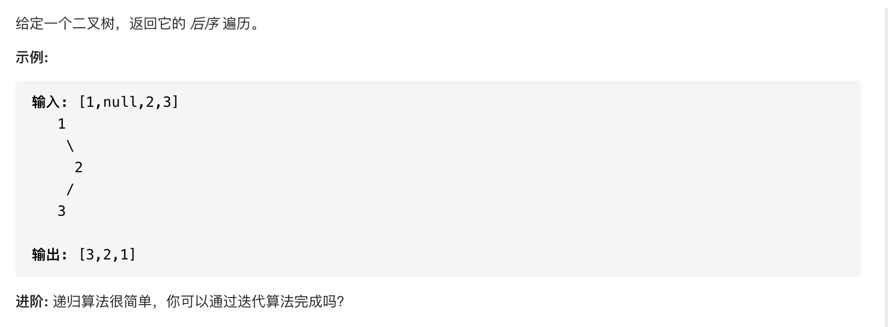

#  **题目描述（简单难度）**

> **[warning] [145. 二叉树的后序遍历](https://leetcode-cn.com/problems/binary-tree-postorder-traversal/)**



#解法一：DFS
```java
class Solution {
    List<Integer> resp = new ArrayList<>();
    public List<Integer> postorderTraversal(TreeNode root) {
       if(null == root){
           return new ArrayList<>();
       }
       dfs(root);
       return resp;
    }
    
    public void dfs(TreeNode root){
        if(root == null){
            return;
        }
        dfs(root.left);
        dfs(root.right);
        resp.add(root.val);
    }
}
```
