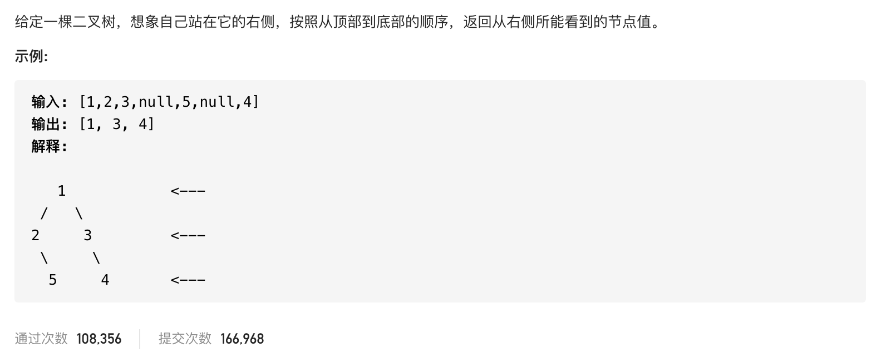

#  **题目描述（中等难度）**

> **[warning] [199. 二叉树的右视图](https://leetcode-cn.com/problems/binary-tree-right-side-view/)**



#解法一： BFS 层次遍历
转换为保存层次遍历的最后一个节点

```java
class Solution {
    public List<Integer> rightSideView(TreeNode root) {
        if (null == root) {
            return new ArrayList<>();
        }
        Deque<TreeNode> deque = new LinkedList<>();
        deque.offer(root);
        List<Integer> resp = new ArrayList<>();
        while (!deque.isEmpty()) {
            int size = deque.size();
            List<Integer> list = new ArrayList<>();
            for (int i = 0; i < size; i++) {
                TreeNode poll = deque.poll();
                list.add(poll.val);
                if (poll.left != null) {
                    deque.offer(poll.left);
                }
                if (poll.right != null) {
                    deque.offer(poll.right);
                }
            }
          resp.add(list.get(list.size()-1));
        }
        return resp;
      
    }
}
```

上面代码优化，在遍历到最后一个的时候直接加到结果集中

```java
class Solution {
    public List<Integer> rightSideView(TreeNode root) {
       if(null == root){
           return new ArrayList<>();
       }
       List<Integer> resp = new ArrayList<>();
       Deque<TreeNode> deque = new LinkedList<>();
       deque.offer(root);
       while(!deque.isEmpty()){
           int size = deque.size();
           for(int i=0;i<size;i++){
              TreeNode poll = deque.poll();
              if(poll.left != null){
                  deque.offer(poll.left);
              }
              if(poll.right != null){
                  deque.offer(poll.right);
              }
              if(i == size-1){
                  resp.add(poll.val);   
              }
           }
       }
       return resp;
    }
}
```
#解法二：DFS

```java
class Solution {
    List<Integer> resp = new ArrayList<>();
    public List<Integer> rightSideView(TreeNode root) {
       if(null == root){
           return new ArrayList<>();
       }
       dfs(root,0);
       return resp;
    }
    
    public void dfs(TreeNode root,int depth){
        if(root == null){
            return;
        }
        if(depth == resp.size()){
            resp.add(root.val);
        }
        depth++;
        dfs(root.right,depth);
        dfs(root.left,depth);
    }
}
```


