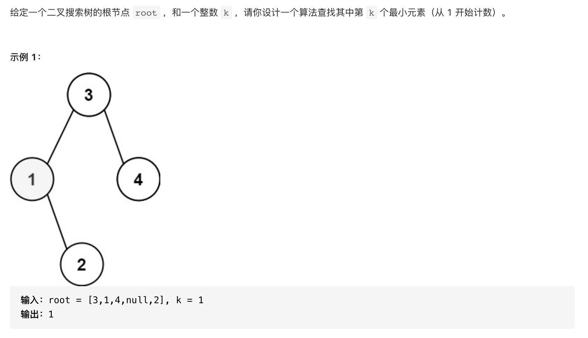
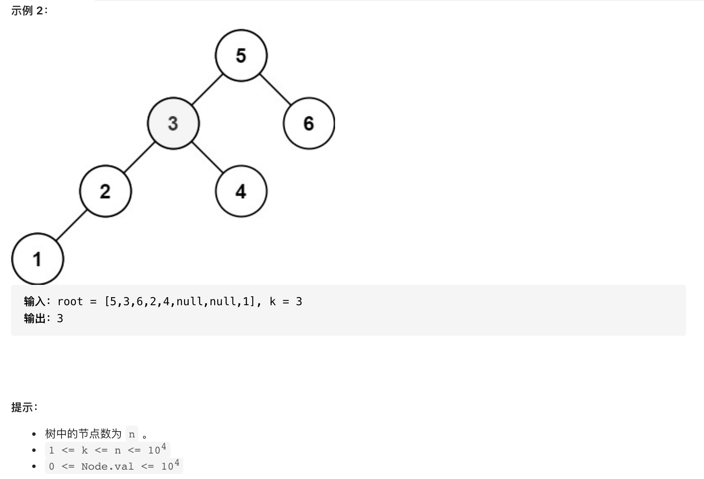

#  **题目描述（中等难度）**

> **[warning] [230. 二叉搜索树中第K小的元素](https://leetcode-cn.com/problems/kth-smallest-element-in-a-bst/)**




#解法一：DFS暴力
```java
class Solution {
    List<Integer> list = new ArrayList<>();
    int res = 0;
    public int kthSmallest(TreeNode root, int k) {
      if(root == null){
          return 0;
      }
      inOrder(root);
      return list.get(k-1);
    }

    public void inOrder(TreeNode root){
        if(root == null){
            return;
        }
        inOrder(root.left);
        list.add(root.val);
        inOrder(root.right);
    }
}
```
**优化一下，提前结束**
```java
class Solution {
    List<Integer> list = new ArrayList<>();
    int res = 0;
    public int kthSmallest(TreeNode root, int k) {
        if(root == null){
            return 0;
        }
        inOrder(root,k);
        return res;
    }

    public void inOrder(TreeNode root,int k){
        if(root == null){
            return;
        }
        inOrder(root.left,k);
        list.add(root.val);
        if(list.size() == k){
            res = root.val;
            return;
        }
        inOrder(root.right,k);
    }
}
```

**再次优化，不使用额外空间，在递归时进行判断**
```java
class Solution {
    int index = 0;
    int res = 0;
    public int kthSmallest(TreeNode root, int k) {
        if(root == null){
            return 0;
        }
        inOrder(root,k);
        return res;
    }

    public void inOrder(TreeNode root,int k){
        if(root == null){
            return;
        }
        inOrder(root.left,k);
        index++;
        if(index == k){
           res = root.val;
           return;
        }
        inOrder(root.right,k);
    }
}
```

#解法二： BFS
```java
class Solution {

    public int kthSmallest(TreeNode root, int k) {
        if (root == null) {
            return 0;
        }
        Deque<TreeNode> deque = new LinkedList<>();
        int index = 0;
        while (!deque.isEmpty() || root != null) {
            while (root != null) {
                deque.offerLast(root);
                root = root.left;
            }
            root = deque.pollLast();
            index++;
            if (index == k) {
                return root.val;
            }
            root = root.right;
        }
        return 0;
    }

}
```


