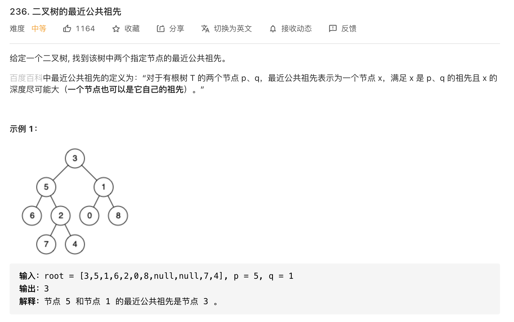

#  **题目描述（简单难度）**

> **[success] [236. 二叉树的最近公共祖先](https://leetcode-cn.com/problems/lowest-common-ancestor-of-a-binary-tree/)**



#解法一：哈希表 存储父节点

**思路**

我们可以用哈希表存储所有节点的父节点，然后我们就可以利用节点的父节点信息从 p 结点开始不断往上跳，并记录已经访问过的节点，再从 q 节点开始不断往上跳，如果碰到已经访问过的节点，那么这个节点就是我们要找的最近公共祖先。

**算法**

从根节点开始遍历整棵二叉树，用哈希表记录每个节点的父节点指针。
从 p 节点开始不断往它的祖先移动，并用数据结构记录已经访问过的祖先节点。
同样，我们再从 q 节点开始不断往它的祖先移动，如果有祖先已经被访问过，即意味着这是 p 和 q 的深度最深的公共祖先，即 LCA 节点。

```java
class Solution {
    HashMap<Integer,TreeNode> map = new HashMap<>();
    Set<Integer> set = new HashSet<>();
    public TreeNode lowestCommonAncestor(TreeNode root, TreeNode p, TreeNode q) {
        dfs(root);
        while( p != null){
            set.add(p.val);
            p = map.get(p.val);
        }
        while(q !=null){
            if(set.contains(q.val)){
                return q;
            }
            q = map.get(q.val);
        }
        return null;
    }

    public void dfs(TreeNode root){
       if(root == null){
           return;
       }
       if(root.left != null){
           map.put(root.left.val,root);
           dfs(root.left);
       }
       if(root.right != null){
           map.put(root.right.val,root);
           dfs(root.right);
       }
    }
}
```


