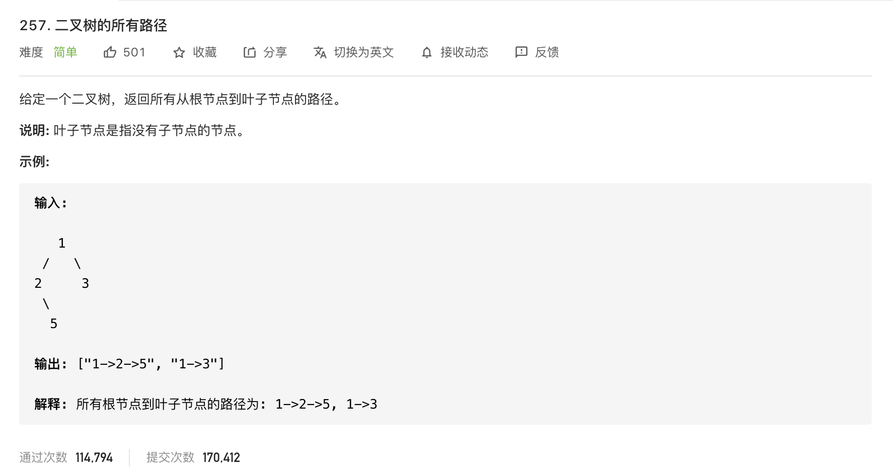

#  **题目描述（简单难度）**

> **[success] [257. 二叉树的所有路径](https://leetcode-cn.com/problems/binary-tree-paths/)**



#解法一： DFS
进行dfs的时候，需要注意不要赋相同的引用。左右子树需要分别创建一个新的StringBuilder
```java
class Solution {
    List<String> list = new ArrayList<>();
    public List<String> binaryTreePaths(TreeNode root) {
        if(null == root){
            return new ArrayList<>();
        }
        dfs(root,new StringBuilder());
        return list;
    }

    public void dfs(TreeNode root,StringBuilder sb){
        if(null == root){
            return;
        }
        sb.append(root.val);
        if(null == root.left && null == root.right){
            list.add(sb.toString());
        }
        else{
            sb.append("->");
            dfs(root.left,new StringBuilder(sb));
            dfs(root.right,new StringBuilder(sb));
        }
    }
}
```

使用数组保存路径

```java
class Solution {
    public static List<List<Integer>> binaryTreePaths(TreeNode root) {
        if (root == null) {
            return new ArrayList<>();
        }
        List<List<Integer>> resp = new ArrayList<>();
        List<Integer> list = new ArrayList<>();
        dfs(root, resp, list);
        return resp;
    }

    public static void dfs(TreeNode root, List<List<Integer>> resp, List<Integer> list) {
        if (root == null) {
            return;
        }
        list.add(root.val);
        if (root.left == null && root.right == null) {
            resp.add(list);
        } else {
            dfs(root.left, resp, new ArrayList<>(list));
            dfs(root.right, resp, new ArrayList<>(list));
        }
    }
}
```


