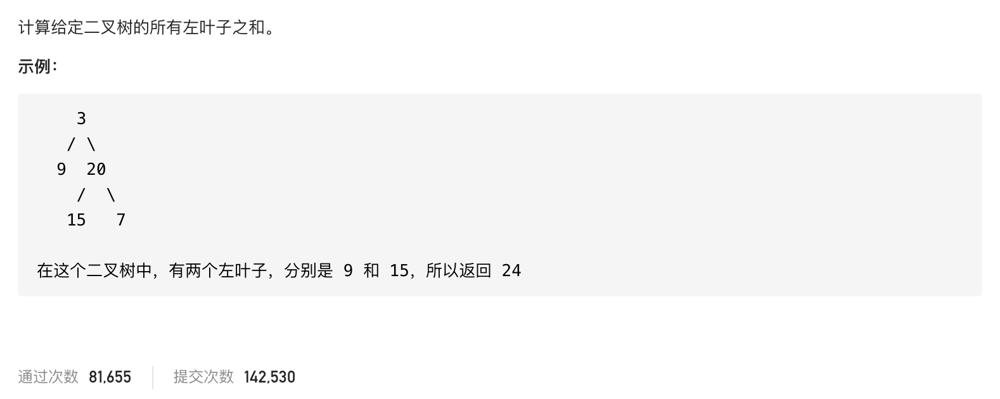

#  **题目描述（简单难度）**

> **[warning] [404. 左叶子之和](https://leetcode-cn.com/problems/sum-of-left-leaves/)**



#解法一：DFS

```java
class Solution {
    public int sumOfLeftLeaves(TreeNode root) {
     if(root == null){
         return 0;
     }
     int sum = 0;
     if(root.left != null && root.left.left == null && root.left.right == null){
         sum = sum + root.left.val;
     }
     return sumOfLeftLeaves(root.left) + sumOfLeftLeaves(root.right) + sum;
    }
}
```

#解法二：BFS
层次遍历时进行判断

```java
class Solution {
    public int sumOfLeftLeaves(TreeNode root) {
     if(root == null){
         return 0;
     }
     Deque<TreeNode> deque = new  LinkedList<>();
     deque.offer(root);
     int sum = 0;
     while(!deque.isEmpty()){
       TreeNode poll =  deque.poll();
       if(poll.left != null){
           if(poll.left.left == null && poll.left.right == null){
               sum = sum + poll.left.val;
           }
           deque.offer(poll.left);   
       }
       if(poll.right != null){
           deque.offer(poll.right);
       }
     }
     return sum;
    }
}
```


