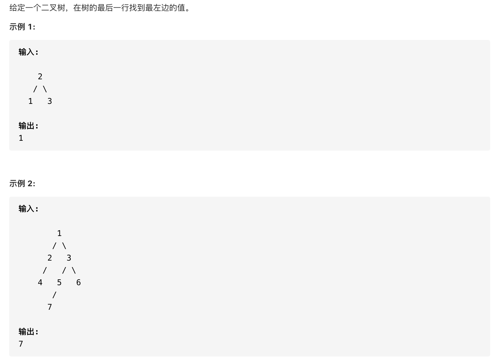

#  **题目描述（中等难度）**

> **[success] [513. 找树左下角的值](https://leetcode-cn.com/problems/find-bottom-left-tree-value/)**



#解法一：BFS
使用队列进行广度优先搜索，使用数组保存每输出的二叉树的层序遍历，访问最后一层，返回最后一层的第一个节点

```java
class Solution {
    List<List<Integer>> ans = new ArrayList<>();
    public int findBottomLeftValue(TreeNode root) {
        if (root == null) {
            return -1;
        }
        levelOrder(root);
        if (ans.size() == 0) {
            return -1;
        }
        List<Integer> resp = ans.get(ans.size()-1);
        return resp.get(0);
    }

    public void levelOrder(TreeNode root){
        Deque<TreeNode> deque = new LinkedList<>();
        deque.offer(root);
        while(!deque.isEmpty()){
            int size = deque.size();
            List<Integer> list = new ArrayList<>();
            for(int i=0;i<size;i++){
                TreeNode poll = deque.poll();
                list.add(poll.val);
                if(null != poll.left){
                    deque.offer(poll.left);
                }
                if(null != poll.right){
                    deque.offer(poll.right);
                }
            }
            ans.add(list);
        }
    }
}
```

#解法二：优化后的BFS

根据从右到做输出层次遍历，出队列的最后一个节点就是最左边的节点，最后一个节点无子节点，退出循环，输出结果

```java
class Solution {
    public int findBottomLeftValue(TreeNode root) {
        if (root == null) {
            return -1;
        }
        Deque<TreeNode> deque  = new LinkedList<>();
        deque.offer(root);
        TreeNode poll = new TreeNode();
        while(!deque.isEmpty()){
            poll = deque.poll();
            if(null != poll.right){
                deque.offer(poll.right);
            }
            if(null != poll.left){
                deque.offer(poll.left);
            }
        }
        return poll.val;
    }
}
```

#解法二：DFS 前序遍历 比较深度 找到最大深度的第一个叶子节点
```java
class Solution {
    int res = 0;
    int maxDepth = -1;
    public int findBottomLeftValue(TreeNode root) {
        if (root == null) {
            return -1;
        }
        dfs(root,0);
        return res;

    }
    public void dfs(TreeNode root,int depth){
        if(null == root){
            return;
        }
        if(depth > maxDepth){
            maxDepth = depth;
            res = root.val;
        }
        dfs(root.left,depth+1);
        dfs(root.right,depth+1);
    }
}
```


