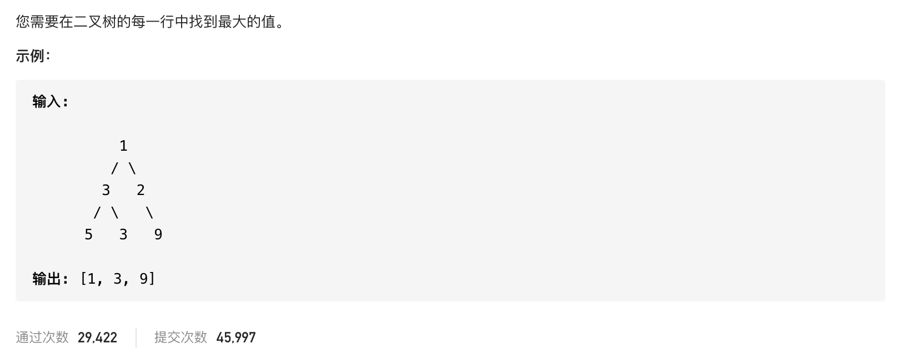

#  **题目描述（中等难度）**

> **[success] [515. 在每个树行中找最大值](https://leetcode-cn.com/problems/find-largest-value-in-each-tree-row/)**



#解法一：BFS 层序遍历
层次遍历保存每行数据，对数据排序输出最大值
```java
class Solution {
    public List<Integer> largestValues(TreeNode root) {
        if (null == root) {
            return new ArrayList<>();
        }
        List<Integer> resp = new ArrayList<>();
        Deque<TreeNode> deque = new LinkedList<>();
        deque.offer(root);
        while (!deque.isEmpty()) {
            int size = deque.size();
            List<Integer> list = new ArrayList<>();
            for (int i = 0; i < size; i++) {
                TreeNode poll = deque.poll();
                list.add(poll.val);
                if (null != poll.left) {
                    deque.offer(poll.left);
                }
                if (null != poll.right) {
                    deque.offer(poll.right);
                }
            }
            Collections.sort(list);
            resp.add(list.get(list.size() - 1));
        }
        return resp;
    }
}
```

上面代码优化
```java
class Solution {
    public List<Integer> largestValues(TreeNode root) {
        if (null == root) {
            return new ArrayList<>();
        }
        List<Integer> resp = new ArrayList<>();
        Deque<TreeNode> deque = new LinkedList<>();
        deque.offer(root);
        while (!deque.isEmpty()) {
            int size = deque.size();
            int max = Integer.MIN_VALUE;
            for (int i = 0; i < size; i++) {
                TreeNode poll = deque.poll();
                max = Math.max(max,poll.val);
                if (null != poll.left) {
                    deque.offer(poll.left);
                }
                if (null != poll.right) {
                    deque.offer(poll.right);
                }
            }
            resp.add(max);
        }
        return resp;
    }
}
```
