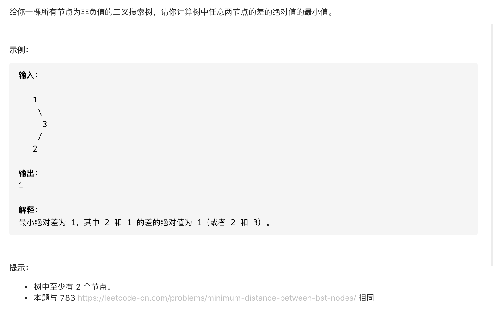

#  **题目描述（简单难度）**

> **[success] [530. 二叉搜索树的最小绝对差](https://leetcode-cn.com/problems/minimum-absolute-difference-in-bst/)**



#解法一：暴力破解 ，输出二叉搜索树中序遍历，再找出最小绝对差

```java
class Solution {
    List<Integer> ans = new ArrayList<>();
    public int getMinimumDifference(TreeNode root) {
      if(null == root){
          return 0;
      }
      dfs(root);
      Integer min = Integer.MAX_VALUE;
      for(int i=0;i<ans.size();i++){
          for(int j=i+1;j<ans.size();j++){
            min = Math.min(min,Math.abs(ans.get(i)-ans.get(j)));
          }
      }
      return min;
    }

    public void dfs(TreeNode root){
        if(root == null){
            return;
        }
        dfs(root.left);
        ans.add(root.val);
        dfs(root.right);
    }
}
```

**优化代码**
二叉搜索树的中序遍历是升序的，相邻数存在最小绝对差，每次判断当前节点与上一节点的最小绝对差值
```java
class Solution {
    Integer min = Integer.MAX_VALUE;
    Integer prevNode = Integer.MAX_VALUE;
    public int getMinimumDifference(TreeNode root) {
        if(null == root){
            return 0;
        }
        int prevNode = root.val;
        inOrder(root);
        return min;
    }

    public void inOrder(TreeNode root){
        if(null == root){
            return;
        }
        inOrder(root.left);
        int temp = Math.abs(root.val-prevNode);
        min = Math.min(min,temp);
        prevNode = root.val;
        inOrder(root.right);
    }
}
```

