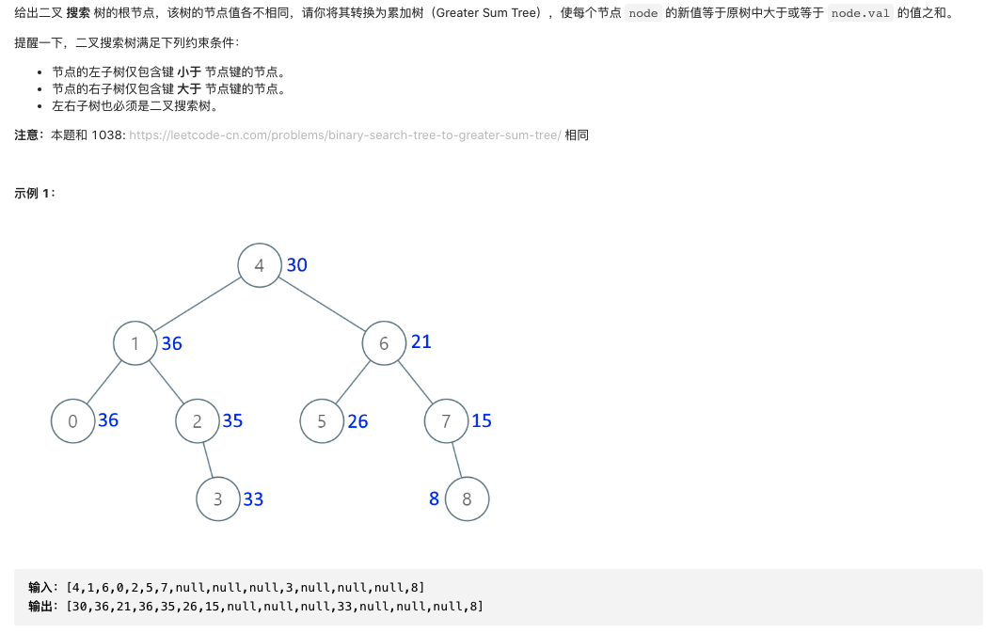
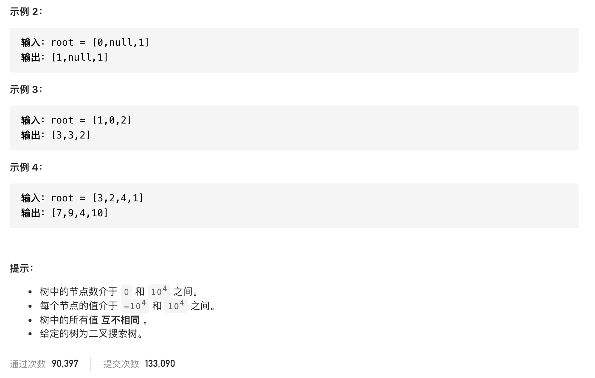

#  **题目描述（中等难度）**

> **[warning] [538. 把二叉搜索树转换为累加树](https://leetcode-cn.com/problems/convert-bst-to-greater-tree/)**




#解法一：DFS 反序中序遍历
思路： 二叉搜索树的中序遍历时升序的，左根右遍历， 使用右根左进行遍历的话，得到的是一个降序的顺序。
这里使用右根左进行递归，递归过程中将节点值加起来。

```java
class Solution {
    int sum = 0;
    public TreeNode convertBST(TreeNode root) {
        if (null == root) {
            return null;
        }
        convertBST(root.right);
        sum = sum + root.val;
        root.val = sum;
        convertBST(root.left);
        return root;
    }
}
```

