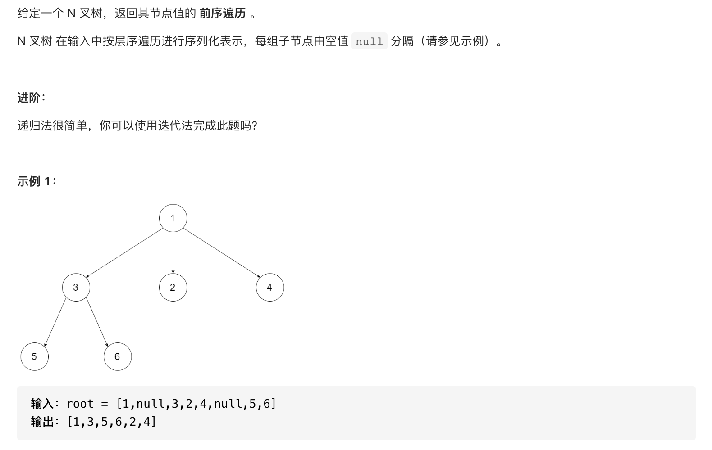

#  **题目描述（简单难度）**

> **[success] [589. N 叉树的前序遍历](https://leetcode-cn.com/problems/n-ary-tree-preorder-traversal/)**



#解法一：DFS

```java
class Solution {
    List<Integer> resp = new ArrayList<>();
    public List<Integer> preorder(Node root) {
        if(root == null){
            return resp;
        }
        dfs(root);
        return resp;
    }

    public void dfs(Node root){
        if(root == null){
            return;
        }
        resp.add(root.val);
        for(Node node : root.children){
            dfs(node);
        }
    }
}
```

#解法二：BFS

```java
class Solution {
    List<Integer> resp = new ArrayList<>();
    public List<Integer> preorder(Node root) {
        if(root == null){
            return resp;
        }
        Deque<Node> deque = new LinkedList<>();
        deque.offer(root);
        while(!deque.isEmpty()){
          Node poll =  deque.pollLast();
          resp.add(poll.val);
          Collections.reverse(poll.children);
          for(Node node : poll.children){
              deque.offerLast(node);
          }
        }
        return resp;
    }
}
```

