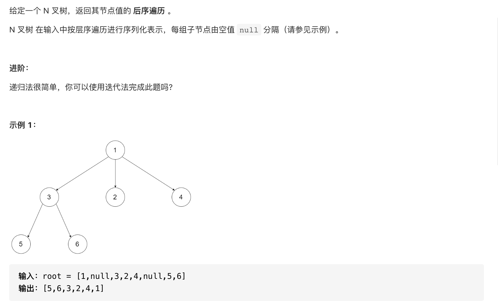

#  **题目描述（简单难度）**

> **[success] [589. N 叉树的前序遍历](https://leetcode-cn.com/problems/n-ary-tree-preorder-traversal/)**



#解法一：DFS
```java
class Solution {
    List<Integer> resp = new ArrayList<>();
    public List<Integer> postorder(Node root) {
      if(null == root){
          return new ArrayList<>();
      }
      dfs(root);
      return resp;
    }

    public void dfs(Node root){
        if(root == null){
            return;
        }
        for(Node node : root.children){
            dfs(node);
        }
        resp.add(root.val);
    }
}
```

```java
class Solution {
    List<Integer> resp = new ArrayList<>();
    public List<Integer> postorder(Node root) {
      if(null == root){
          return new ArrayList<>();
      }
      Deque<Node> deque = new LinkedList<>();
      deque.offerLast(root);
      while(!deque.isEmpty()){
         Node node = deque.pollLast();
         resp.add(node.val);
         for(Node child : node.children){
             deque.offerLast(child);
         }
      }
      Collections.reverse(resp);
      return resp;
    }
}
```


