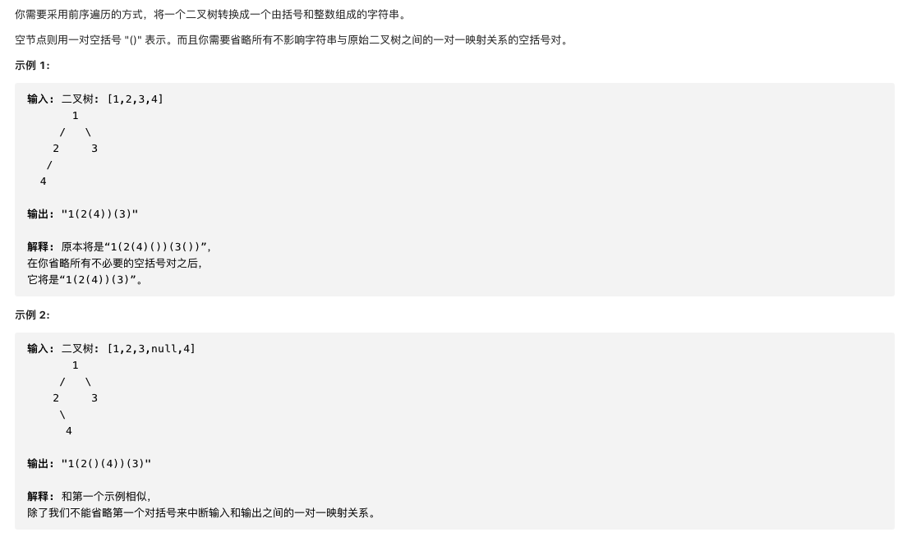

#  **题目描述（简单难度）**

> **[success] [606. 根据二叉树创建字符串](https://leetcode-cn.com/problems/construct-string-from-binary-tree/)**



#解法一：DFS
```java
class Solution {
    public String tree2str(TreeNode root) {
       if(root == null){
           return null;
       }
       StringBuilder sb = new StringBuilder();
       preOrder(root,sb);
       return sb.toString();
    }

    public void preOrder(TreeNode root,StringBuilder sb){
        if(root == null){
            return;
        }
        sb.append(root.val);
        if(root.left != null || root.right != null){
            sb.append("(");
            preOrder(root.left,sb);
            sb.append(")");
            if(root.right != null){
                sb.append("(");
                preOrder(root.right,sb);
                sb.append(")");
            }
        }
    }
}
```


