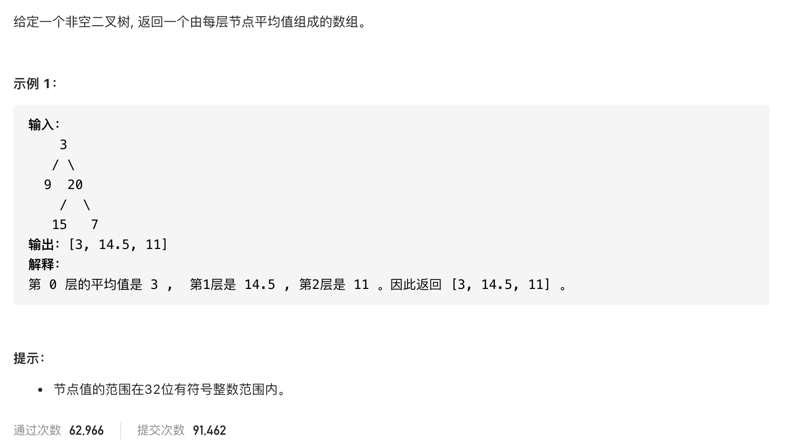

#  **题目描述（简单难度）**

> **[success] [637. 二叉树的层平均值](https://leetcode-cn.com/problems/average-of-levels-in-binary-tree/)**



#解法一： BFS
层序遍历，对每层数据进行求和，除以每层数的个数得出结果保存

```java
class Solution {
    public List<Double> averageOfLevels(TreeNode root) {
      if(null == root){
          return new ArrayList<>();
      }
      List<Double>  resp = new ArrayList<>();
      Deque<TreeNode> deque = new LinkedList<>();
      deque.offer(root);
      while(!deque.isEmpty()){
          int size = deque.size();
          Double sum =  new Double(0);
          for(int i=0;i<size;i++){
             TreeNode poll = deque.poll();
              sum = sum + poll.val;
             if(null != poll.left){
                 deque.offer(poll.left);
             }
             if(null !=poll.right){
                 deque.offer(poll.right);
             }
          }
          resp.add(sum/size);
      }
      return resp;
    }
}
```

