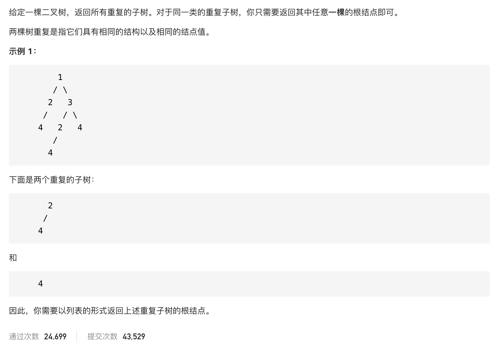

#  **题目描述（简单难度）**

> **[success] [652. 寻找重复的子树](https://leetcode-cn.com/problems/find-duplicate-subtrees/)**



#解法一：DFS二叉树序列化

```java
class Solution {
    Map<String,Integer> map = new HashMap<>();
    List<TreeNode> resp = new ArrayList<>();
    public List<TreeNode> findDuplicateSubtrees(TreeNode root) {
        if(root == null){
            return new ArrayList<>();
        }
        preOrderSerial(root,new StringBuilder());
        return resp;
    }

    public String preOrderSerial(TreeNode root,StringBuilder sb){
        if(root == null){
           return "#";
        }
      
        sb.append(root.val).append(",").append(preOrderSerial(root.left,new StringBuilder())).append(",").append(preOrderSerial(root.right,new StringBuilder()));

        map.put(sb.toString(),map.getOrDefault(sb.toString(),0)+1);

        if(map.get(sb.toString()) == 2){
            resp.add(root);
        }
        return sb.toString();
    }
}
```
