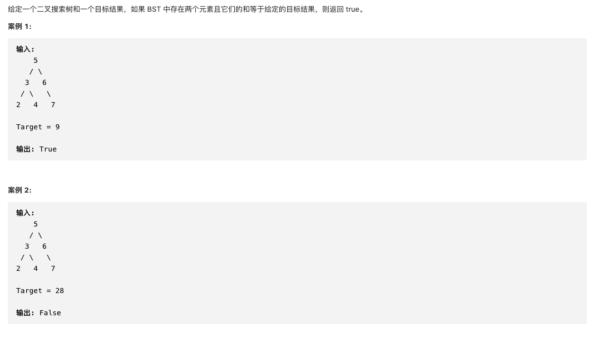

#  **题目描述（简单难度）**

> **[success] [653. 两数之和 IV - 输入 BST](https://leetcode-cn.com/problems/two-sum-iv-input-is-a-bst/)**



#解法一：DFS后求两数之和

```java
class Solution {
    List<Integer> list = new ArrayList<>();
    public boolean findTarget(TreeNode root, int k) {
       if(root == null){
           return false;
       }
       preOrder(root);
       Map<Integer,Integer> map = new HashMap<>();
       for(int i=0;i<list.size();i++){
         if(map.containsKey(k-list.get(i))){
             return true;
         }
         map.put(list.get(i),i);
       }
       return false;
    }

    public void preOrder(TreeNode root){
      if(null == root){
          return;
      }
      list.add(root.val);
      preOrder(root.left);
      preOrder(root.right);
    }
}
```
优化上面代码
```java
class Solution {
    Map<Integer,Integer> map = new HashMap<>();
    public boolean findTarget(TreeNode root, int k) {
       if(root == null){
           return false;
       }
      return preOrder(root,k);
    }

    public boolean preOrder(TreeNode root,int k){
      if(null == root){
          return false;
      }
      if(map.containsKey(k-root.val)){
          return true;
      }
      map.put(root.val,root.val);
      return preOrder(root.left,k) || preOrder(root.right,k);
    }
}
```

#解法二： BFS

```java
class Solution {
    public boolean findTarget(TreeNode root, int k) {
        if(root == null){
            return false;
        }
        Map<Integer,Integer> map = new HashMap<>();
        Deque<TreeNode> deque = new LinkedList<>();
        deque.offer(root);
        while(!deque.isEmpty()){
           TreeNode node = deque.poll();
           if(map.containsKey(k-node.val)){
               return true;
           }
           map.put(node.val,node.val);
           if(node.left != null){
               deque.offer(node.left);
           }
           if(node.right != null){
               deque.offer(node.right);
           }
        }
        return false;
    }
}
```

#解法三：BST
利用BST的特性，二叉搜索树进行中序遍历，是一个有序的递增数组。
对递增数组进行双指针求两数之和

```java
class Solution {
    List<Integer> list = new ArrayList<>();
    public boolean findTarget(TreeNode root, int k) {
        if (root == null) {
            return false;
        }
        inOrder(root);
        int l = 0;
        int r = list.size() - 1;
        while (l < r) {
            if (list.get(l) + list.get(r) == k) {
                return true;
            }
            if (list.get(l) + list.get(r) > k) {
                r--;
            } else {
                l++;
            }
        }
        return false;

    }
    public void inOrder(TreeNode root){
        if(root == null){
            return;
        }
        inOrder(root.left);
        list.add(root.val);
        inOrder(root.right);
    }
}
```


