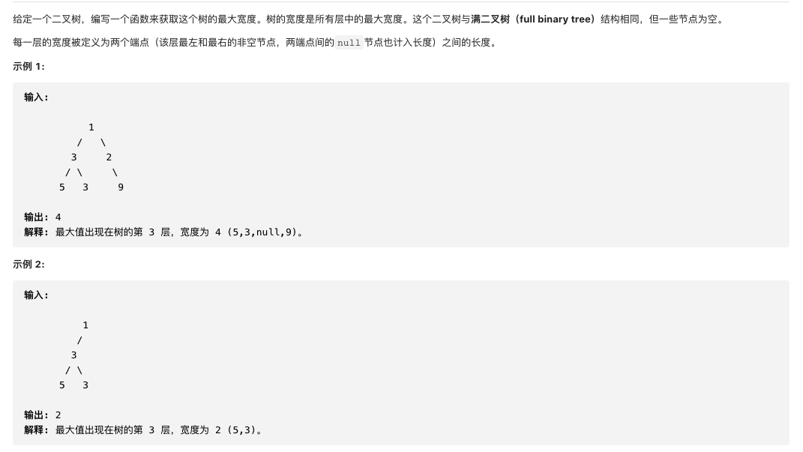
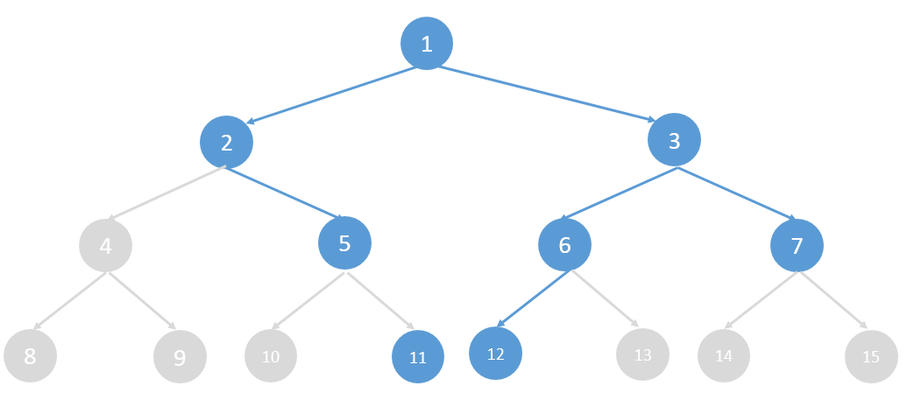

#  **题目描述（中等难度）**

> **[warning] [662. 二叉树最大宽度](https://leetcode-cn.com/problems/maximum-width-of-binary-tree/)**



#解法一：BFS
二叉树的最大宽度我们可以认为是从最左边到最右边的最大距离，假如是一棵满二叉树的话，每一层的最大距离就是最左边到最右边的节点数。因为二叉树不一定都是满二叉树

我们可以这样来计算，把它想象成为一颗满二叉树，假如根节点是遍历的第1个节点，那么他的两个子节点分别是遍历的第2个和第3个节点。并且可以推算出如果一个节点是第n个遍历的，那么他的两个子节点分别是第n*2和n*2+1个遍历的，具体我们来画个图看一下



```java
class Solution {
    public int widthOfBinaryTree(TreeNode root) {
    if(root == null){
        return 0;
    }
    Deque<TreeNode> deque = new LinkedList<>();
    deque.offer(root);
    root.val = 1;
    int maxWidth = 0;
     while(!deque.isEmpty()){
       int size = deque.size();
       List<Integer> ans = new ArrayList<>();
       int left = deque.peekFirst().val;
       int right = deque.peekLast().val;
       maxWidth = Math.max(maxWidth,right-left+1);
       for(int i=0;i<size;i++){
           TreeNode node = deque.poll();
           int position = node.val;
           if(node.left != null){
               node.left.val = position*2;
               deque.offer(node.left);
           }
           if(node.right != null){
               node.right.val = position*2+1;
               deque.offer(node.right);
           }
       }
     }
     return maxWidth;
    }
}
```


