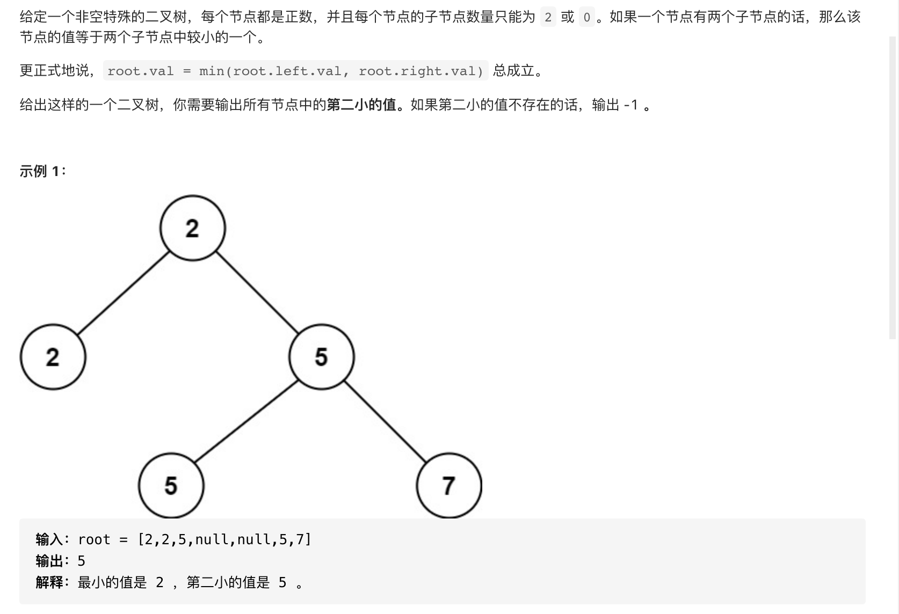
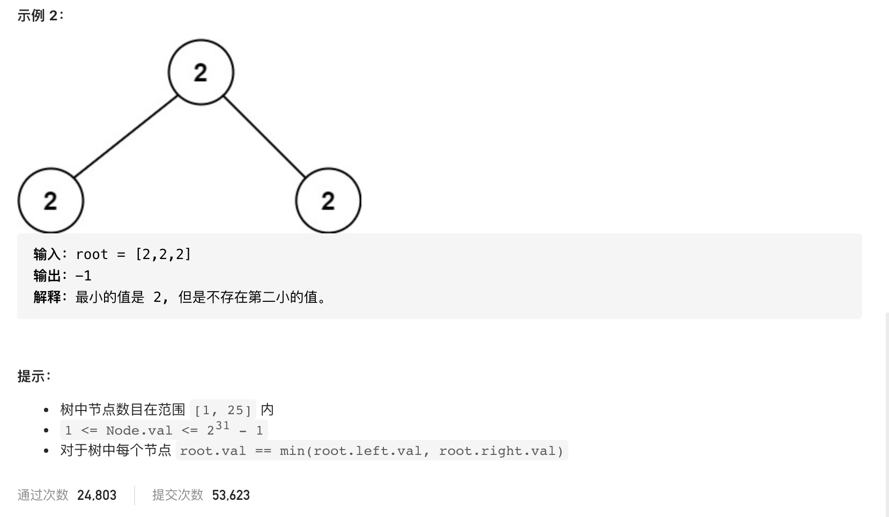

#  **题目描述（简单难度）**

> **[success] [671. 二叉树中第二小的节点](https://leetcode-cn.com/problems/second-minimum-node-in-a-binary-tree/)**




#解法一： DFS 使用TreeSet排序去重 保存先序遍历的值，输出第二小的数

```java
class Solution {
    TreeSet<Integer> treeSet = new TreeSet<>();
    public int findSecondMinimumValue(TreeNode root) {
        if(root == null){
            return -1;
        }
        preOrder(root);
        List<Integer> list = new ArrayList<>(treeSet);
        if(list.size() >=2){
            return list.get(1);
        }
        return -1;
    }

    public void preOrder(TreeNode root) {
        if (root == null) {
            return;
        }
        treeSet.add(root.val);
        preOrder(root.left);
        preOrder(root.right);
    }
}
```

