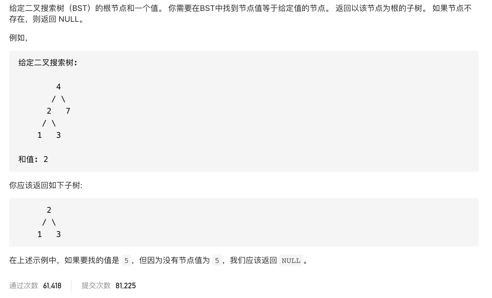

#  **题目描述（中等难度）**

> **[success] [700. 二叉搜索树中的搜索](https://leetcode-cn.com/problems/search-in-a-binary-search-tree/)**




#解法一：DFS遍历二叉树判断
```java
class Solution {
    TreeNode result = null;
    public TreeNode searchBST(TreeNode root, int val) {
        if (null == root) {
            return null;
        }
        preOrder(root, val);
        return result;
    }

    public void preOrder(TreeNode root, int val) {
        if (root == null) {
            return;
        }
        preOrder(root.left, val);
        if (root.val == val) {
            result = root;
            return;
        }
        preOrder(root.right, val);
    }
}
```

#解法一：BFS遍历处理

```java
class Solution {
    TreeNode result = null;
    public TreeNode searchBST(TreeNode root, int val) {
        if (null == root) {
            return null;
        }
        Deque<TreeNode> deque = new LinkedList<>();
        while(!deque.isEmpty() || root !=null){
            while(root != null){
                if(root.val == val){
                    result = root;
                }
                deque.offerFirst(root);
                root = root.left;
            }
            root = deque.pollFirst();
            root = root.right;
        }
        return result;
    }
}
```

#解法三：DFS优化
思路：利用二叉搜索树的特性解决，二叉树中序遍历时升序的，左根右

二叉搜索树是一棵二叉树，每个节点都有以下特性：
- 大于左子树上任意一个节点的值，
- 小于右子树上任意一个节点的值。
```java
class Solution {
    public TreeNode searchBST(TreeNode root, int val) {
        if (root == null) {
            return null;
        }
        if (root.val == val) {
            return root;
        }
        if (root.val > val) {
            return searchBST(root.left, val);
        } else {
            return searchBST(root.right, val);
        }
    }
}
```

简化代码
```java
class Solution {
  public TreeNode searchBST(TreeNode root, int val) {
    if (root == null || val == root.val) return root;

    return val < root.val ? searchBST(root.left, val) : searchBST(root.right, val);
  }
}
```


