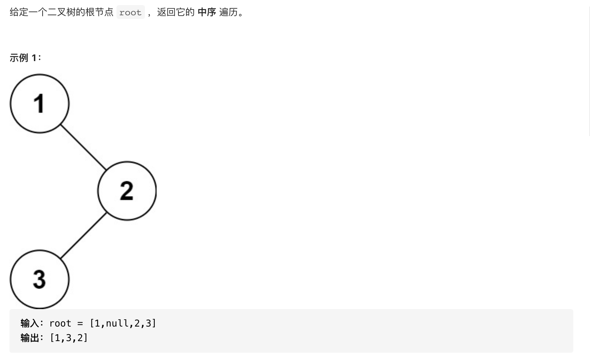

#  **题目描述（简单难度）**

> **[success] [94. 二叉树的中序遍历](https://leetcode-cn.com/problems/binary-tree-inorder-traversal/)**



#解法一：DFS
```java
class Solution {
    List<Integer> resp = new ArrayList<>();
    public List<Integer> inorderTraversal(TreeNode root) {
        if (null == root) {
            return new ArrayList<>();
        }
        middleOrder(root);
        return resp;
    }

    public void middleOrder(TreeNode root){
        if(root == null){
            return;
        }
        middleOrder(root.left);
        resp.add(root.val);
        middleOrder(root.right);
    }
}
```

#解法二：BFS
```java
class Solution {
    List<Integer> resp = new ArrayList<>();
    public List<Integer> inorderTraversal(TreeNode root) {
        if (null == root) {
            return new ArrayList<>();
        }
        Deque<TreeNode> deque = new LinkedList<>();
        while (!deque.isEmpty() || root != null) {
            while (root != null) {
                deque.offerLast(root);
                root = root.left;
            }
            root = deque.pollLast();
            resp.add(root.val);
            root = root.right;
        }
        return resp;
    }
}
```

