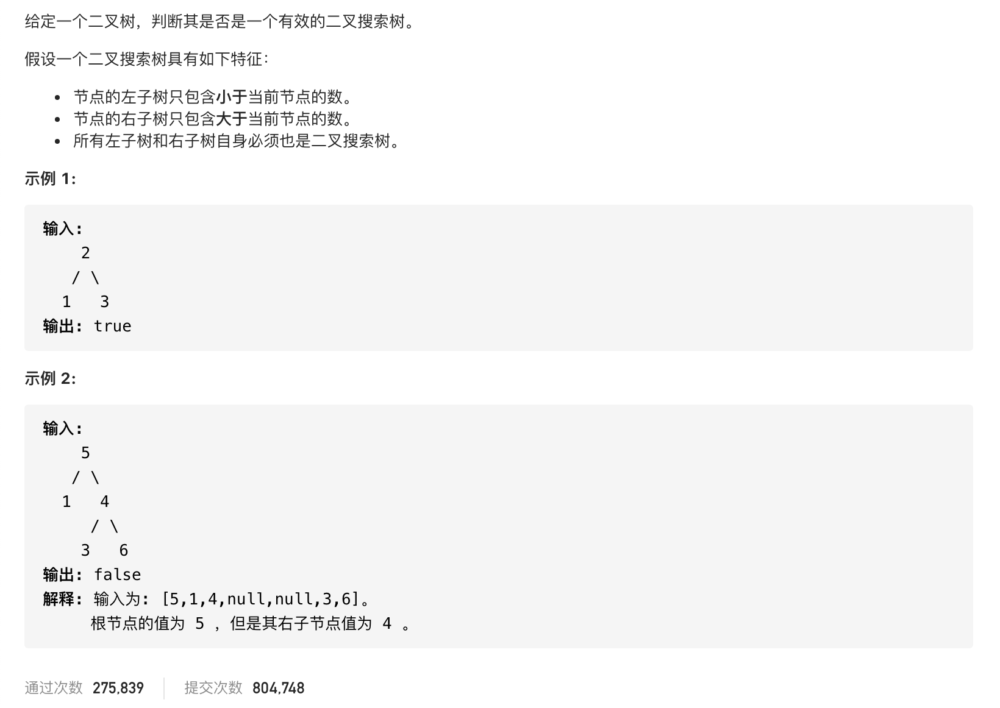

#  **题目描述（中等难度）**

> **[warning] [98. 验证二叉搜索树](https://leetcode-cn.com/problems/validate-binary-search-tree/)**



#解法一：DFS
利用二叉搜索树的特性，根节点总大于左子树，遍历每个节点，判断是否大于左子树，
中序遍历时升序的，判断当前节点值是否大于前一个节点值

```java
class Solution {
    Long prev = Long.MIN_VALUE;
    boolean flag = true;
    public boolean isValidBST(TreeNode root) {
      if(root == null){
          return false;
      }
      dfs(root);
      return flag;
    }

    public void dfs(TreeNode root){
        if(root == null){
            return;
        }
        dfs(root.left);
        if(root.val <= prev){
            flag = false;
        }
        prev =  Long.valueOf(root.val);
        dfs(root.right);
    }
}
```
#解法二：BFS

```java
class Solution {
    public boolean isValidBST(TreeNode root) {
        if (root == null) {
            return false;
        }
        Deque<TreeNode> deque = new LinkedList<>();
        Long prevNum = Long.MIN_VALUE;
        while(!deque.isEmpty() || root != null){
            while(root != null){
                deque.offerLast(root);
                root = root.left;
            }
            root = deque.pollLast();
            if(root.val <= prevNum){
                return false;
            }
            prevNum = Long.valueOf(root.val);
            root = root.right;
        }
        return true;
    }
}
```


