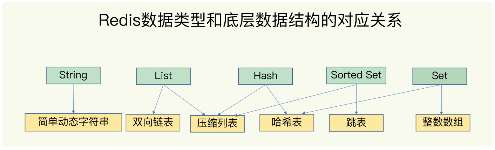

# Redis

##Redis底层数据结构与实现
Redis底层数据结构一共有六种，分别是动态字符串、双向链表、压缩列表、哈希表、跳表和整形列表。

为了实现从键到值的快速访问，Redis的键和值使用一个哈希表来保存,哈希桶中的entry元素中保存了*key和*value指针，分别指向了实际的键和值。

**潜在的风险点** 为什么哈希表操作变慢了？

原因：哈希表的冲突问题和rehash操作可能带来的操作阻塞。

