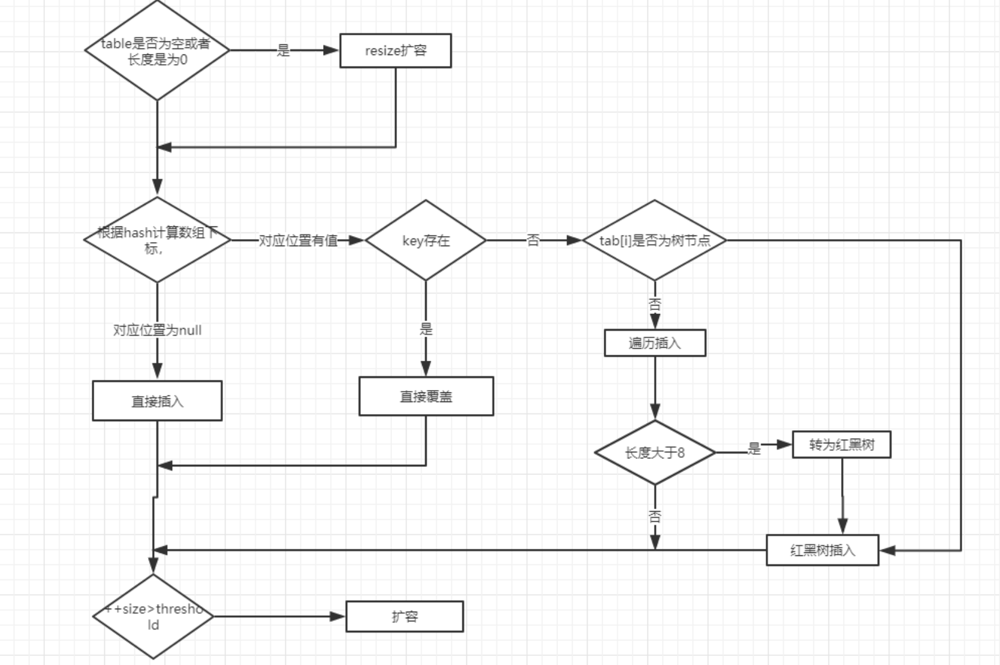

# 面经总结

## hashmap的底层数据结构，put的过程。

JDK1.7 ,HashMap底层是数据和链表结合在一起使用，也就是链表散列

JDK1.8 ,HashMap底层是数据和链表和红黑树结合一起使用

jdk1.8在解决哈希冲突时有了较大的变化，当链表长度大于阈值（默认为8）时，将链表转化为红黑树，以减少搜索时间。

put过程

##Hashmap是否是线程安全的，多线程下会有什么问题？concurrentHashMap底层是如何实现线程安全的。
HashMap不是线程安全的，HashTable 和concurrentHashMap是线程安全的，HashTable 是全局锁，HashTable容器使用synchronized来保证线程安全，concurrentHashMap分段锁，性能更高。

HashMap在多线程下会出现死循环问题

原因：HashMap出现死循环的条件是，当两个线程同时对原有的旧的Hash表扩容时，当其中一个线程正在扩容时（遍历单向链表）切换到另外一个线程进行扩容操作，并且在线程二中完成了所有的扩容操作，此时再切换到线程1中就可能造成单向链表形成一个环，从而在下一次查询操作时就可能发生死循环。

concurrentHashMap底层是如何实现线程安全的？

HashTable容器在竞争激烈的并发环境下表现出效率低下的原因，是因为所有访问HashTable的线程都必须竞争同一把锁，那假如容器里有多把锁，每一把锁用于锁住容器中的一部分数据，那么当多线程访问容器里不同数据段的数据时，线程间就不会存在锁竞争，从而可以有效的提高并发访问效率，这就是ConcurrentHashMap所使用的锁分段技术，首先将数据分成一段一段的存储，然后给每一段数据配一把锁，当一个线程占用锁访问其中一个段数据时，其他段的数据也能被其他线程访问。

concurrentHashMap原理？

ConcurrentHashMap采用的是分段式锁，可以理解为把一个大的Map拆封成N个小的Segment，在put数据时会根据hash来确定具体存放在哪个Segment中，Segment内部的同步机制是基于Lock操作的，每一个Segment都会分配一把锁，当线程占用锁访问其中一段数据时，其他段的数据也能被其他线程访问，也就是实现并发访问。

能说一下ConcurrentHashMap在JDK1.7和JDK1.8中的区别吗？

