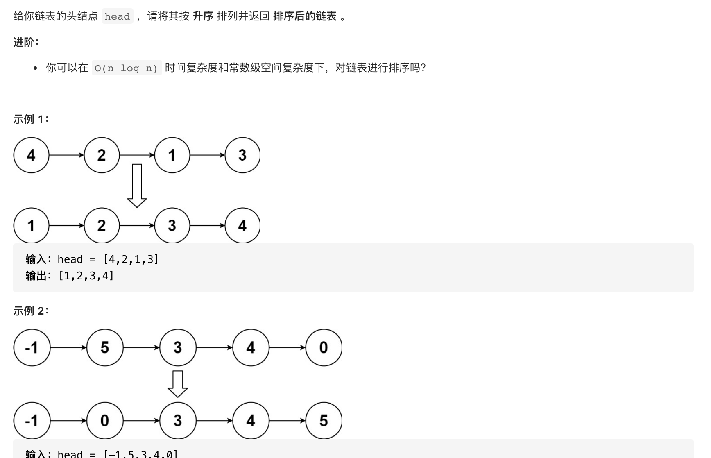

#  **题目描述（中等难度）**

> **[warning] [148. 排序链表](https://leetcode-cn.com/problems/sort-list/)**



#解法一： 暴力，不符合空间复杂度

```java
class Solution {
    List<Integer> ans = new ArrayList<>();
    public ListNode sortList(ListNode head) {
       if(head == null){
           return head;
       }
       ListNode curr = head;
       while(curr != null){
           ans.add(curr.val);
           curr = curr.next;
       }
       Collections.sort(ans);
       ListNode resp = new ListNode(-1);
       for(int i=0;i<ans.size();i++){
           addNode(resp,ans.get(i));
       }
       return resp.next;

    }

    public void addNode(ListNode head,int val){
        ListNode temp = head;
        while(temp.next != null){
            temp = temp.next;
        }
        ListNode node = new ListNode(val);
        temp.next = node;
    }
}
```

#解法二： 归并排序

```java
class Solution {
    public ListNode sortList(ListNode head) {
       if(head == null || head.next == null){
           return head;
       }
       ListNode midNode = middleNode(head);
       ListNode rightHead = midNode.next;
       midNode.next = null;


       ListNode left =  sortList(head);
       ListNode right = sortList(rightHead);

       //合并两个有序链表
        return mergeListNode(left,right);

    }

    public ListNode mergeListNode(ListNode left,ListNode right){
       ListNode resp = new ListNode(-1);
       ListNode curr = resp;
       while(left != null && right != null){
           if(left.val < right.val){
               curr.next = left;
               curr = curr.next;
               left = left.next;
           }
           else{
               curr.next = right;
               curr = curr.next;
               right = right.next;
           }
       }
       while(left != null){
           curr.next = left;
           curr = curr.next;
           left = left.next;
       }
       while(right != null){
           curr.next = right;
           curr = curr.next;
           right = right.next;
       }
       return resp.next;

    }
    //获取链表中间节点
    public ListNode middleNode(ListNode head){
        if(head == null){
            return head;
        }
        ListNode slow = head;
        ListNode fast = head.next;
        while(fast != null && fast.next != null){
            slow = slow.next;
            fast = fast.next.next;
        }
        return slow;
    }
}
```
