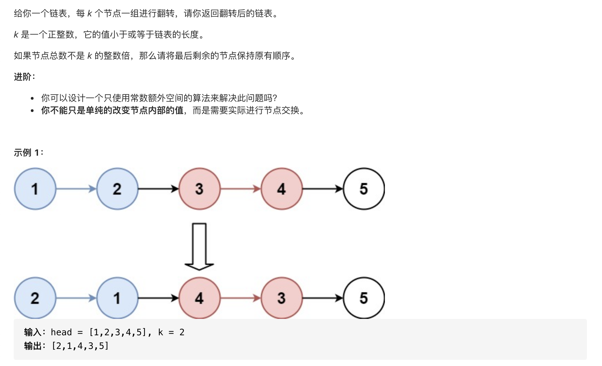

#  **题目描述（中等难度）**

> **[warning] [25. K 个一组翻转链表](https://leetcode-cn.com/problems/reverse-nodes-in-k-group/)**



#解法一：翻转链表

```java
class Solution {

    public ListNode reverseKGroup(ListNode head, int k) {
        if(head == null || head.next == null){
            return head;
        }
        ListNode dummy = new ListNode(-1);
        dummy.next = head;

        //初始化pre和end都指向dummy。pre指每次要翻转的链表的头结点的上一个节点。end指每次要翻转的链表的尾节点
        ListNode pre = dummy;
        ListNode end = dummy;

        while(end != null){
            //循环k次，找到需要翻转的链表的结尾,这里每次循环要判断end是否等于空,因为如果为空，end.next会报空指针异常。
            //dummy->1->2->3->4->5 若k为2，循环2次，end指向2
            for(int i=0;i<k && end !=null;i++){
                end = end.next;
            }
            //如果end==null，即需要翻转的链表的节点数小于k，不执行翻转。
            if(end == null){
                break;
            }
            //记录下要翻转链表的头节点
            ListNode start = pre.next;
            //先记录下end.next,方便后面链接链表
            ListNode next = end.next;
            //然后断开链表
            end.next = null;
            //翻转链表,pre.next指向翻转后的链表。1->2 变成2->1。 dummy->2->1
            pre.next = reverse(start);
            //翻转后头节点变到最后。通过.next把断开的链表重新链接。
            start.next = next;
            //将pre换成下次要翻转的链表的头结点的上一个节点。即start
            pre = start;
            //翻转结束，将end置为下次要翻转的链表的头结点的上一个节点。即start
            end = pre;

        }
        return dummy.next;

    }

    public ListNode reverse(ListNode head){
        if(head == null || head.next == null){
            return head;
        }
        ListNode curr = head;
        ListNode temp = null;
        ListNode prev = null;
        while(curr != null){
            temp = curr.next;
            curr.next = prev;
            prev = curr;
            curr = temp;
        }
        return prev;
    }
}
```

